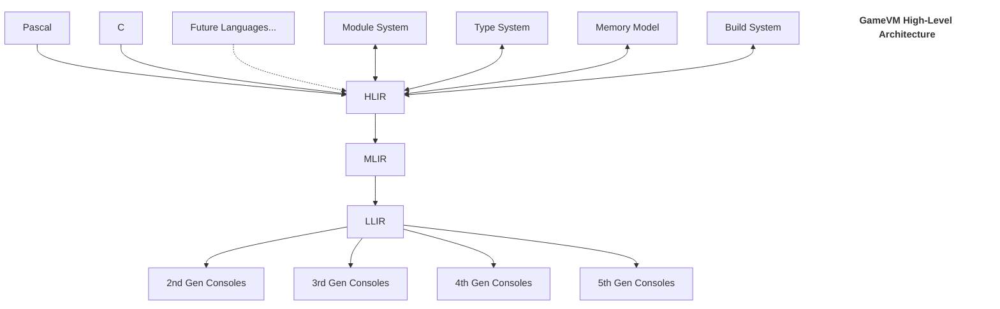

# GameVM Architecture Overview

## 1. Introduction

### 1.1 Purpose
This document provides a high-level architectural overview of the GameVM system, describing its core components, their relationships, and key design decisions.

### 1.2 Host/Target Philosophy
GameVM is a **cross-compiler system**. All complex analysis, optimization, and transformation happen on a modern host computer (PC/Mac/Linux). The output of this process is a tailored binary (ROM or disk image) for a specific retro gaming target.

- **Host (PC)**: Runs the compiler toolchain, manages the module dependency graph, and performs whole-program optimization across the IR pipeline (HLIR -> MLIR -> LLIR).
- **Target (Console)**: The actual retro hardware or emulator. It executes the final binary, which the compiler has emitted using one of several **dispatch techniques** (e.g., Native machine code, DTC, ITC, STC, or TTC).

### 1.3 Definitions
- **HLIR**: High-Level Intermediate Representation (Host-only AST).
- **MLIR**: Mid-Level Intermediate Representation (Host-only optimization graph).
- **LLIR**: Low-Level Intermediate Representation. This is the **Virtual Machine ISA**, modeling a hybrid accumulator-based architecture.
- **Virtual Machine (VM)**: The implementation of the LLIR ISA on the target. Depending on the chosen dispatch method, the emitted code can take the form of:
    - **Native Instructions**: AOT-compiled machine code.
    - **Subroutine Calls**: A sequence of native `JSR/CALL` instructions (STC).
    - **Address Lists**: A list of memory pointers (DTC/ITC).
    - **Tokens**: 1-byte instruction indices (**Bytecode**).

## 2. Core Architecture

### 2.1 High-Level Architecture



### 2.2 Component Relationships

1. **Frontends**
   - Language-specific parsers and analyzers
   - Convert source code to HLIR
   - Handle language-specific features and idioms

2. **Intermediate Representations**
   - **HLIR (High-Level IR)**: Language-agnostic, preserves high-level semantics
   - **MLIR (Mid-Level IR)**: Focuses on optimizations and resource management
   - **LLIR (Low-Level IR)**: Close to machine code, architecture-specific

3. **Backends**
   - Generate code for 2nd-5th generation gaming consoles
   - Optimize for console-specific hardware capabilities
   - Handle memory constraints of retro gaming platforms
   - Handle platform-specific optimizations
   - Manage memory layout and calling conventions

4. **Core Services (Host)**
   - **Module System**: Manages dependencies and code organization
   - **Type System**: Ensures type safety across language boundaries
   - **Build System**: Coordinates compilation and linking
5. **Runtime Services (Target)**
   - **Dynamic Loading**: Handles relocatable modules and overlays on RAM-based systems
   - **Memory Model**: Bare-metal memory management optimized for target constraints
   - **Interpreter/VM**: The generated execution engine for LLIR bytecode

## 3. Data Flow

### 3.1 Compilation Pipeline
```
Source Code → Frontend → HLIR → MLIR → LLIR → Target Code
    │           │          │        │        │
    │           │          │        │        └──▶ Optimization
    │           │          │        └──────────▶ Architecture-Specific
    │           │          └───────────────────▶ High-Level Optimizations
    │           └──────────────────────────────▶ Language-Specific Analysis
    └──────────────────────────────────────────▶ Source Mapping
```

### 3.2 Runtime Flow
```
┌─────────────┐    ┌─────────────┐    ┌─────────────┐
│ Application │───▶│  GameVM     │◀──▶│  Platform   │
│  Code       │◄───│  Runtime    │    │  Services   │
└─────────────┘    └─────────────┘    └─────────────┘
        ▲                  ▲
        │                  │
        └──────────────────┘
       Debugging & Profiling
```

## 4. Key Design Decisions

### 4.1 Intermediate Representations
- Three-tier IR design for optimal balance between high-level optimizations and low-level code generation
- Clear separation of concerns between language frontends and platform backends

### 4.2 Cross-Platform Support
- Abstracted hardware interfaces for different console generations
- Consistent execution model across platforms

## 5. Cross-Cutting Concerns

### 5.1 Memory Management
- Unified memory model across languages
- Garbage collection strategies
- Memory safety guarantees

### 5.2 Error Handling
- Unified error reporting
- Exception handling across language boundaries
- Debug information

### 5.3 Performance
- Optimization passes
- Memory access patterns
- Parallel execution

## 4. Integration Points

### 4.1 Language Integration
- Foreign Function Interface (FFI)
- Type conversion rules
- Memory sharing

### 4.2 Platform Integration
- System calls
- Hardware access
- Input/Output

## 5. Build and Deployment

### 5.1 Build Process
1. Parse source files
2. Generate HLIR
3. Apply optimizations
4. Generate target code
5. Link dependencies

### 5.2 Packaging
- Module packaging
- Resource bundling
- Deployment artifacts

## 6. Related Documents
- [HLIR Design](../compiler/HLIR.md)
- [MLIR Design](../compiler/MLIR.md)
- [LLIR Design](../compiler/LLIR.md)
- [Module System](../compiler/ModuleResolution.md)
- [Dynamic Loading](../compiler/DynamicLoading.md)
- [Build System](../compiler/BuildSystem.md)
- [Type System](../compiler/TypeSystem.md)
