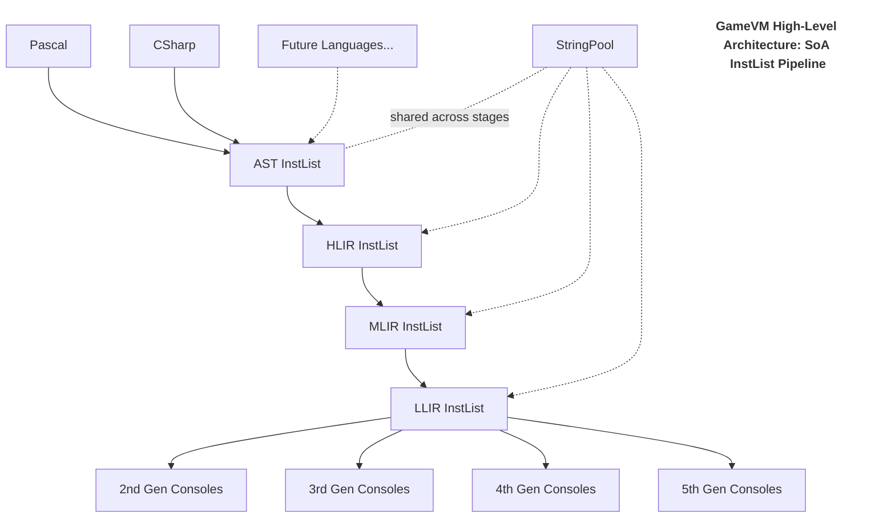

# GameVM Architecture Overview [implemented]

## 1. Introduction [implemented]

### 1.1 Purpose [implemented]
This document provides a high-level architectural overview of the GameVM system, describing its core components, their relationships, and key design decisions.

### 1.2 Host/Target Philosophy [implemented]
GameVM is a **cross-compiler system**. All complex analysis, optimization, and transformation happen on a modern host computer (PC/Mac/Linux). The output of this process is a tailored binary (ROM or disk image) for a specific retro gaming target.

- **Host (PC)**: Runs the compiler toolchain, manages the module dependency graph, and performs whole-program optimization across the SoA `InstList` IR pipeline (AST -> HLIR -> MLIR -> LLIR).
- **Target (Console)**: The actual retro hardware or emulator. It executes the final binary, which the compiler has emitted using one of several **dispatch techniques** (e.g., Native machine code, DTC, ITC, STC, or TTC).

### 1.3 Definitions [implemented]
- **AST InstList**: The parse-tree representation, emitted directly from the ANTLR parse tree into an `InstList` with `AstNodeKind` tags.
- **HLIR**: High-Level Intermediate Representation (Host-only, language-agnostic `InstList`).
- **MLIR**: Mid-Level Intermediate Representation (Host-only optimization `InstList`).
- **LLIR**: Low-Level Intermediate Representation. This is the **Virtual Machine ISA**, a small 6502-adjacent `InstList` instruction set.
- **Virtual Machine (VM)**: The implementation of the LLIR ISA on the target. Depending on the chosen dispatch method, the emitted code can take the form of:
    - **Native Instructions**: AOT-compiled machine code.
    - **Subroutine Calls**: A sequence of native `JSR/CALL` instructions (STC).
    - **Address Lists**: A list of memory pointers (DTC/ITC).
    - **Tokens**: 1-byte instruction indices (**Bytecode**).

## 2. Core Architecture

### 2.1 High-Level Architecture [implemented]


```mermaid
graph TD
    %% Frontend Nodes
    P[Pascal] --> AST[AST InstList]
    CS[CSharp] --> AST
    FUTURE[Future Languages...] -.-> AST

    %% IR Pipeline (all SoA InstList)
    AST --> H[HLIR InstList]
    H --> M[MLIR InstList]
    M --> L[LLIR InstList]

    %% Backend Targets
    L --> GEN2[2nd Gen Consoles]
    L --> GEN3[3rd Gen Consoles]
    L --> GEN4[4th Gen Consoles]
    L --> GEN5[5th Gen Consoles]

    %% Core Services
    SP[StringPool] -. shared across stages .- AST
    SP -.-> H
    SP -.-> M
    SP -.-> L

    %% Add a title
    classDef titleStyle fill:none,stroke:none,font-weight:bold,font-size:16px
    Title[GameVM High-Level Architecture: SoA InstList Pipeline]:::titleStyle
```

### 2.2 Component Relationships [implemented]

1. **Frontends** (Pascal, C#) — parse source directly into an **AST `InstList`** (no OOP AST node hierarchy).
2. **Transformers** (`IIRSlabTransformer`) — lower one IR stage to the next:
   - `AstSlabToHlirSlabTransformer.Transform(astSlab)` → HLIR `InstList`
   - `HlirSlabToMlirSlabTransformer.Transform(hlirSlab)` → MLIR `InstList`
   - `MidToLowLevelTransformer.TransformSlab(mlirSlab, stringPool)` → LLIR `InstList`
3. **Optimizers** — operate directly on the flat `InstList`:
   - `IMidLevelOptimizer.OptimizeSlab(hlirSlab, stringPool, level)` → MLIR
   - `ILowLevelOptimizer.OptimizeSlab(llirSlab, stringPool, level)` → LLIR
4. **Backends** — `ICodeGenerator` (`Atari2600CodeGenerator`) reads the final LLIR `InstList` and emits ROM/bytecode for 2nd-5th generation gaming consoles, handling platform-specific optimizations, memory layout, and calling conventions.

5. **Core Services (Host)** [implemented, aspirational]
   - **StringPool**: shares interned identifier offsets across all IR stages
   - **Module System**: Manages dependencies and code organization
   - **Type System**: Ensures type safety across language boundaries
   - **Build System**: Coordinates compilation and linking

6. **Runtime Services (Target)** [aspirational]
   - **Dynamic Loading**: Handles relocatable modules and overlays on RAM-based systems
   - **Memory Model**: Bare-metal memory management optimized for target constraints
   - **Interpreter/VM**: The generated execution engine for LLIR bytecode

## 3. IR Pipeline (DOD SoA) [implemented]

Every IR stage is a **Struct-of-Arrays (SoA) `InstList`**: parallel `byte[] Tags`, `ushort[] Flags`, `ushort[] ArgCounts`, `uint[] FixedOps` (4 slots/instruction), `uint[] Extra` (variable-length operand pool), `uint[] ExtraOffsets`, `int[] BlockIds`. Instructions are read via `GetOperands(instIdx)` / `GetOperand(instIdx, opIdx)`, and built via `InstListBuilder`. See `HLIR.md`, `MLIR.md`, `LLIR.md`, and `APIDocumentation.md` for the full reference.

### 3.1 Source to AST InstList
The frontend (e.g., `PascalFrontend`, `CSharpFrontend`) parses source code directly into an **AST `InstList`** (tags = `AstNodeKind`, operands = child `InstIndex` pointers or `StringPool` offsets). There is no intermediate OOP AST node hierarchy; the parse tree is lowered directly into the `uint[]` slab through the `PascalToSlabVisitor`.

### 3.2 HLIR InstList
`AstSlabToHlirSlabTransformer.Transform(astSlab)` consumes the AST `InstList` and produces an HLIR `InstList` whose `Tags` are `MlirInstructionKind` and operands are `StringPool` offsets. HLIR abstracts away declarations and expression trees; it is a flat sequence of instructions.

### 3.3 MLIR InstList
`HlirSlabToMlirSlabTransformer.Transform(hlirSlab)` rewrites HLIR `InstList` into an MLIR `InstList`. `IMidLevelOptimizer.OptimizeSlab(hlirSlab, stringPool, level)` then performs host-only optimizations (dead-code elimination, constant folding, register-allocation previews, superinstruction identification) and produces an optimized MLIR `InstList`.

### 3.4 LLIR InstList
`MidToLowLevelTransformer.TransformSlab(mlirSlab, stringPool)` lowers MLIR to the small, 6502-adjacent LLIR `InstList` (`LlirInstructionKind`: Label, Load, Store, Call, Jump, Branch, Return, Syscall). `ILoowLevelOptimizer.OptimizeSlab(llirSlab, stringPool, level)` applies low-level optimizers (e.g., cycle budgeting, zero-page promotion for Atari 2600) and produces the final LLIR `InstList`.

### 3.5 Code Generation
`Atari2600CodeGenerator.GenerateFromSlab(llirSlab, stringPool, options)` reads the LLIR `InstList` with `GetOperands` / `GetOperand` and emits a 4KB ROM (`$F000`-`$FFFF`). Other targets/dispatch techniques (native code, DTC/ITC/STC/TTC) are selected by dispatch strategy.

### 3.6 The `StringPool`
Identifiers are interned once at parse time, producing `StringPool` offsets. All IR stages reuse the same `StringPool` (see `compiler_architecture.md`); offsets, not strings, are carried through every `InstList`. This enables deterministic layout and efficient cross-stage symbol resolution.

## 4. Key Design Decisions

### 4.1 Intermediate Representations [implemented]
- Four-tier IR (AST, HLIR, MLIR, LLIR) as SoA `InstList` — optimal balance between high-level optimizations and low-level code generation.
- Data-oriented design: no object nodes, no pointer chasing; flat, cache-friendly arrays.

### 4.2 Cross-Platform Support [aspirational]
- Abstracted hardware interfaces for different console generations.
- Consistent execution model (LLIR ISA) across platforms.

## 5. Cross-Cutting Concerns

### 5.1 Memory Management [implemented]
- Unified memory model across languages.
- Static allocation and deterministic lifetime management (no GC for retro targets).
- Backend-specific optimizations (zero-page for 8-bit targets, bank-switching for later systems).

### 5.2 Error Handling [implemented]
- Unified error reporting from all IR stages.
- AST parse errors, semantic validation, and code-gen errors captured in the final `CompilationResult`.

### 5.3 Performance [implemented]
- Optimized `InstList` layout for cache-friendly iteration.
- Fast-path operand access (`FixedOps` <=4 operands via `GetOperands`, `Extra` region otherwise).
- Whole-program optimization opportunities due to flat IR.

## 6. Integration Points [implemented, aspirational]

### 6.1 Language Integration [implemented]
- Foreign Function Interface (FFI)
- Type conversion rules across languages (unified, width-aware type system)
- Memory sharing between modules

### 6.2 Platform Integration [aspirational]
- System calls (SYSCALL vector)
- Hardware access / TIA register mapping (Atari 2600)
- Input/Output

## 7. Build and Deployment [implemented]

### 7.1 Compilation Pipeline [implemented]
```
Pascal/C# source
   → AST InstList          (PascalFrontend / CSharpFrontend - ParseToSlab)
   → HLIR InstList        (AstSlabToHlirSlabTransformer)
   → MLIR InstList        (IMidLevelOptimizer.OptimizeSlab)
   → LLIR InstList        (MidToLowLevelTransformer.TransformSlab)
   → LLIR (optimized)     (ILowLevelOptimizer.OptimizeSlab)
   → ROM / bytecode       (Atari2600CodeGenerator.GenerateFromSlab)
```

### 7.2 Packaging [aspirational]
- Module packaging
- Resource bundling
- Deployment artifacts

## 8. Related Documents [updated]
- [HLIR Design](../compiler/HLIR.md) — SoA HLIR instruction format and construction
- [MLIR Design](../compiler/MLIR.md) — SoA MLIR optimization pipeline
- [LLIR Design](../compiler/LLIR.md) — SoA LLIR (6502-adjacent) and codegen notes
- [LLIR ISA](../compiler/LLIR_ISA.md) — instruction set, opcode table, operand encoding
- [Compiler Architecture](../compiler/compiler_architecture.md) — high-level overview of the SoA pipeline
- [API Documentation](../api/APIDocumentation.md) — public API for `InstList`, `InstListBuilder`, and transformation interfaces
- [Module System](../compiler/ModuleResolution.md) — Dependency DAG and static loading
- [Dynamic Loading](../compiler/DynamicLoading.md) — Relocation for bare-metal targets
- [Build System](../compiler/BuildSystem.md) — Command-line interface, dispatch techniques
- [Type System](../compiler/TypeSystem.md) — Unified, width-aware type system
- [Inline Assembly](../compiler/InlineAssembly.md) — Portable assembly syntax for LLIR