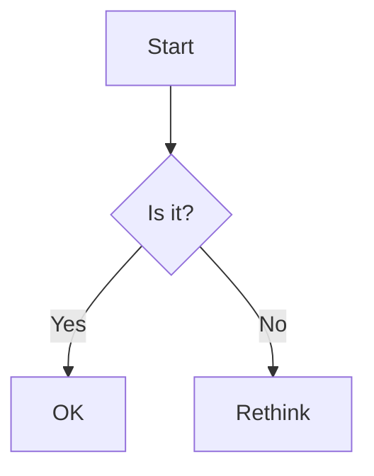

# GameVM Documentation Standards

## 1. Document Structure

### 1.1 Front Matter
All documentation files must begin with YAML front matter:

```yaml
---
title: Document Title
description: Brief description of the document's purpose
author: Author Name
created: YYYY-MM-DD
updated: YYYY-MM-DD
version: 1.0.0
---
```

### 1.2 Required Sections
Every design document should include these standard sections:

```markdown
# Document Title

## 1. Introduction
### 1.1 Purpose
### 1.2 Scope
### 1.3 Definitions

## 2. Design
### 2.1 Overview
### 2.2 Components
### 2.3 Data Structures

## 3. Implementation
### 3.1 Algorithms
### 3.2 Performance Considerations

## 4. Examples

## 5. References
```

## 2. Formatting Guidelines

### 2.1 Document Width
- Maximum line length: 100 characters
- Use soft wraps at 80 characters where possible
- No trailing whitespace

### 2.2 Headers
- Use ATX-style headers with `#`
- Capitalize first letter of each word (Title Case)
- No trailing punctuation
- Header levels should increase by one level at a time
- Leave one blank line before and after headers

### 2.3 Code Blocks
- Use fenced code blocks with language specification
- Include a descriptive caption when helpful
- For command-line examples, use `console` as the language
- For configuration files, specify the format (yaml, toml, etc.)

````markdown
```csharp
// C# example with syntax highlighting
public class Example {
    public string Name { get; set; }
}
```

*Example 1: Sample C# class*

```console
# Command line example
dotnet build
```

*Example 2: Building the project*
````

### 2.4 Tables
- Use pipe syntax for tables
- Include a header row
- Align columns with colons
- Keep tables simple; split complex tables into multiple simple ones

```markdown
| Feature         | Status      | Notes                     |
|-----------------|-------------|---------------------------|
| Compiler        | In Progress | Core features complete    |
| Virtual Machine | Planned     | Design phase              |
| Debugger        | Backlog     | Requirements gathering    |

*Table 1: Project component status*
```

## 3. Writing Style

### 3.1 Voice and Tone
- Use active voice
- Be concise but thorough
- Address the reader as "you"
- Use present tense for current functionality
- Use future tense for planned features
- Avoid first person (I, we) in reference documentation

### 3.2 Terminology
- Use consistent terminology across all documents
- Define all technical terms on first use
- Use backticks for:
  - Code elements: `functionName`
  - File paths: `src/compiler/`
  - Commands: `dotnet build`
  - Parameters: `--output`
- Use **bold** for UI elements: Click **Save** to continue
- Use *italics* for emphasis or document titles: See *Architecture Overview*

## 4. Diagrams and Visuals

### 4.1 Diagram Tools
- Use Mermaid for flowcharts and diagrams
- Include alt text for accessibility

Example:
````markdown

````

## 5. Version Control & File Organization

### 5.1 File Naming
- Use `PascalCase.md` for document names
- Keep filenames short but descriptive (max 3-4 words)
- Use hyphens for multi-word names: `Module-Name.md`
- Place system-specific documentation in the `systems/` directory
- Place design documents in the `design/` directory

### 5.2 Cross-Referencing
- Link to other documents using relative paths: `[link text](../path/to/file.md)`
- When referencing sections within the same document, use relative links: `[See Introduction](#1-introduction)`
- For external links, include the full URL with descriptive text: `[GitHub](https://github.com)`

### 5.3 Changelog
Maintain a changelog at the end of each document, ordered from newest to oldest:

```markdown
## Changelog

### [Unreleased]
- Added new section on cross-referencing
- Updated formatting guidelines

### [1.0.0] - 2025-01-01
- Initial version
```

## 6. Virtual Machine Documentation

### 6.1 VM-Specific Guidelines
- Document all VM instructions with their opcodes and behaviors
- Include cycle counts for performance-sensitive operations
- Document memory map and addressing modes
- Include examples of common operations

### 6.2 Instruction Format
Use the following template for documenting VM instructions:

```markdown
### `OP_NAME` (0xXX)

**Description**: Brief description of the instruction

**Syntax**: `OP_NAME [operands]`

**Operation**:
```c
// Pseudocode showing the operation
accumulator = memory[operand];
```

**Flags Affected**:
- Z: Set if result is zero
- N: Set if result is negative
- C: Set if carry occurs

**Cycles**: X

**Examples**:
```asm
; Load immediate value 42 into accumulator
LDA #42
```
```

## 6. Review Process

### 6.1 Peer Review
- All documents require at least one review
- Use GitHub pull requests for review
- Address all review comments

### 6.2 Updating Documents
- Update the changelog when making changes
- Keep diagrams up to date
- Verify all links

## 7. Related Documents
- [Architecture Overview](./ArchitectureOverview.md)
- [Type System](../compiler/TypeSystem.md)
