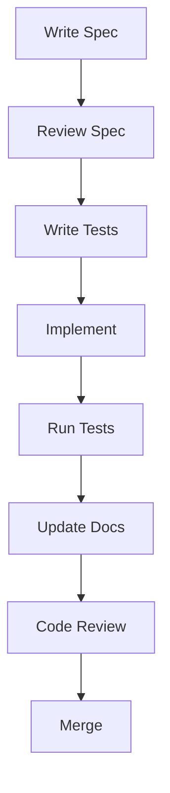

# Specification-Driven Development Guide

## 1. Introduction to SDD

### 1.1 What is SDD?
Specification-Driven Development (SDD) is a software development approach where:
- Specifications are written before implementation
- Code is developed to meet the specifications
- Tests are derived from the specifications
- Documentation is kept in sync with the code

### 1.2 Benefits
- Clear requirements before coding begins
- Better test coverage
- Improved documentation
- Easier onboarding of new team members
- Fewer bugs and regressions

## 2. Writing Specifications

### 2.1 Specification Template
```markdown
# [Component Name] Specification

## 1. Purpose
[Why this component exists]

## 2. Interface
[Public API definitions]

## 3. Behavior
[Expected behavior and edge cases]

## 4. Error Handling
[Error conditions and recovery]

## 5. Performance
[Performance characteristics and constraints]

## 6. Security
[Security considerations]
```

### 2.2 Best Practices
- Be precise and unambiguous
- Include examples
- Consider edge cases
- Document assumptions
- Keep it concise but complete

## 3. From Specification to Code

### 3.1 Implementation Steps
1. Write the specification
2. Get it reviewed
3. Write tests based on the spec
4. Implement the code
5. Verify against the spec
6. Update documentation

### 3.2 Example Workflow


## 4. Testing with SDD

### 4.1 Test-First Approach
1. Write a failing test
2. Implement the minimum code to pass
3. Refactor while keeping tests green

### 4.2 Property-Based Testing
```typescript
describe('Parser', () => {
  test('should parse any valid expression', (expr) => {
    expect(() => parse(expr)).not.toThrow();
  });
});
```

## 5. Code Review Guidelines

### 5.1 Review Checklist
- [ ] Implementation matches spec
- [ ] All requirements are met
- [ ] Tests cover all cases
- [ ] Documentation is updated
- [ ] Code follows style guide

## 6. Common Pitfalls

### 6.1 Anti-Patterns to Avoid
- Writing code before the spec is approved
- Vague or ambiguous requirements
- Ignoring edge cases
- Skipping documentation updates

## 7. Tools and Resources

### 7.1 Recommended Tools
- **Linting**: ESLint, TSLint
- **Testing**: Jest, Mocha, QuickCheck
- **Documentation**: TypeDoc, JSDoc
- **CI/CD**: GitHub Actions, CircleCI

## 8. Getting Help

### 8.1 Resources
- [SDD Workflow](./SDDWorkflow.md)
- [API Documentation](../api/APIDocumentation.md)
- [Component Specifications](./ComponentSpecs/)

## 9. FAQ

### 9.1 Common Questions
**Q: How detailed should specifications be?**
A: Detailed enough to be unambiguous, but not so detailed that they're hard to maintain.

**Q: What if the spec is wrong?**
A: Update the spec first, then update the implementation and tests.

## 10. Best Practices

### 10.1 Do's and Don'ts
- **Do**: Keep specs up to date
- **Do**: Review specs thoroughly
- **Don't**: Bypass the spec process
- **Don't**: Treat specs as optional

### 10.2 Continuous Improvement
- Regularly review and update specs
- Learn from implementation challenges
- Share knowledge with the team
