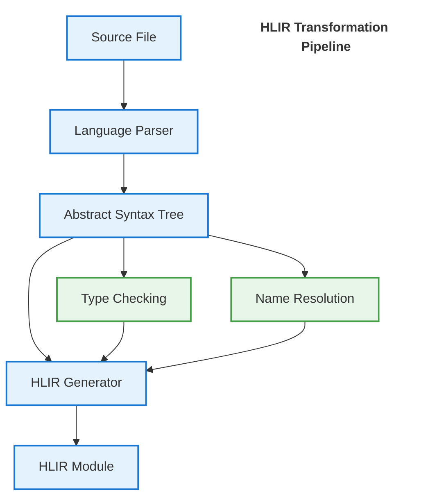

# GameVM Module Resolution System Design

## 1. Introduction

### 1.1 Purpose
This document outlines the design of GameVM's unified module resolution system, which enables seamless integration of modules across multiple programming languages through a canonical [High-Level Intermediate Representation (HLIR)](./HLIR.md). The system implements a language-agnostic approach to dependency management, type resolution, and ABI compliance, providing a robust foundation for polyglot development.

### 1.2 Key Features
- **Unified HLIR as Canonical Source of Truth**: All languages compile to a single, language-agnostic HLIR.
- **Strict DAG Enforcement**: Circular dependencies between modules are strictly forbidden to ensure deterministic builds and zero-cost cross-language linking.
- **Centralized ABI Management**: Eliminates the need for per-language ABI implementations.
- **Compiler-Native Resolution**: Moves beyond text-based includes to semantic dependency tracking.

### 1.3 Scope
- Module discovery and resolution
- Cross-language dependency management
- Version conflict resolution
- Build system integration
- Development tooling support

### 1.4 Related Documents
- [Architecture Overview](../architecture/ArchitectureOverview.md)
- [Type System](./TypeSystem.md)
- [Build System](./BuildSystem.md)

## 2. Architecture Overview

### 2.3 Module Lifecycle

1. **Module Definition**
   - Source files with explicit module declarations
   - Language-specific module metadata
   - Dependencies and exports

2. **Compilation**
   - Source → HLIR transformation (see [HLIR Documentation](./HLIR.md))
   - Semantic analysis
   - Type checking across module boundaries

3. **Linking**
   - Resolution of cross-module references
   - Symbol binding
   - Dead code elimination

4. **Loading**
   - Dynamic module loading
   - Runtime linking
   - Dependency injection

### 2.1 Core Principles

1. **Language-Agnostic HLIR**
   - Single source of truth for types and interfaces
   - Unified memory model and ABI
   - Platform-independent representation

2. **Structured Dependency Graph**
   - Semantic understanding of module relationships
   - Support for fine-grained dependency tracking
   - Enables whole-program optimization

3. **Compiler-Native Resolution**
   - Moves beyond text inclusion to semantic resolution
   - Supports both static and dynamic linking models
   - Enables precise dependency analysis

### 2.2 Core Components

1. **HLIR Compiler**
   - Converts source modules to canonical HLIR
   - Manages type system unification
   - Handles ABI compliance

2. **Dependency Resolver**
   - Constructs and analyzes module dependency graph
   - Implements hybrid resolution algorithm
   - Handles version constraints and conflicts

3. **Module Loader**
   - Manages module lifecycle
   - Handles dynamic loading and linking
   - Maintains module cache

## 3. Module Representation

### 3.3 Example: Multi-Language Module

#### C++ Module (`math/vector.h`)
```cpp
#pragma once
#include <cstdint>

namespace Math {
    class Vector2 {
    public:
        Vector2(float x, float y);
        float Length() const;
        
        float x, y;
    };
}
```

#### Corresponding HLIR Module
```typescript
{
    name: 'Math.Vector',
    sourceFile: 'math/vector.h',
    types: {
        'Vector2': {
            kind: 'struct',
            fields: [
                { name: 'x', type: 'f32' },
                { name: 'y', type: 'f32' }
            ],
            methods: [
                { name: 'Length', returnType: 'f32', params: [] }
            ]
        }
    },
    imports: [],
    exports: ['Vector2']
}
```

### 3.1 HLIR as the Universal Intermediate

HLIR serves as the common intermediate representation for all source languages, enabling seamless cross-language interoperability. The transformation to HLIR occurs as the first compilation step after language-specific parsing.

#### Key Properties of HLIR:
- **Language-Agnostic**: Represents concepts common across all supported languages
- **Complete Semantics**: Includes both declarations and implementations
- **Type-Rich**: Maintains full type information for all entities
- **Location-Aware**: Preserves source mapping for debugging

#### Transformation Pipeline:



For C/C++, the HLIR generation includes:
1. Header parsing and semantic analysis
2. Extraction of public declarations
3. Generation of module interface
4. Integration with implementation units

```typescript
interface HLIRModule {
    // Module identity
    name: string;                // Logical module name (e.g., 'Game.Graphics')
    sourceFile: string;          // Path to source file
    
    // Semantic entities (all names are relative to module)
    types: Map<string, HLIRType>;          // Type definitions
    functions: Map<string, HLIRFunction>;  // Function signatures
    constants: Map<string, HLIRConstant>;  // Compile-time constants
    
    // Module boundaries
    imports: HLIRImport[];        // Explicit module dependencies
    exports: Set<string>;        // Publicly visible entities (qualified names)
    
    // Compilation context
    sourceMap: SourceMap;        // Maps HLIR entities to source locations
    language: string;            // Source language
    version: string;             // Module version (if applicable)
}

interface HLIRImport {
    module: string;              // Canonical module name
    members: string[];           // Specific imports (empty for module import)
    version: string;             // Version constraint
}

interface HLIRExport {
    name: string;                // External name
    internalName: string;        // Internal name (if different)
    kind: 'type' | 'function' | 'variable';
    visibility: 'public' | 'package' | 'protected' | 'private';
}
```

### 3.2 Language Integration

Each language frontend is responsible for mapping its native module system to the canonical HLIR format:

| Language | Module Concept        | HLIR Mapping Strategy             |
| -------- | --------------------- | --------------------------------- |
| C        | Header/Source         | Semantic analysis of declarations |
| C++      | Header/Source/Modules | AST transformation to HLIR        |
| C#       | Assemblies/Namespaces | Metadata-based extraction         |
| Java     | Packages/Classes      | Class file parsing                |
| Pascal   | Units                 | Direct mapping to HLIR modules    |
| Lua      | Modules/Tables        | Runtime module analysis           |

### 3.2 Module Structure

A module is a single, self-contained source file that can be independently compiled. The module system treats each source file as a distinct module with a logical name derived from its file path and language conventions.

#### 3.2.1 Module Identification and Header Handling

- **Module Naming Rules**:
  - Pascal: `Game.Graphics.pas` → `Game.Graphics`
  - C#: `Game/Graphics.cs` → `Game.Graphics` (from namespace)
  - C/C++: `Game/Graphics.h` or `Game/Graphics.hpp` → `Game.Graphics`
  - Java: `com/example/Graphics.java` → `com.example.Graphics`
  - JavaScript: `game/graphics.js` → `game.graphics`
  - Python: `game/graphics.py` → `game.graphics`
  - Lua: `game/graphics.lua` → `game.graphics`

- **C/C++ Special Handling**:
  - Headers (`.h`, `.hpp`) and source files (`.c`, `.cpp`, `.cc`) map to the same module
  - `#include "Game/Graphics.h"` and `#include <Game/Graphics>` resolve to the same module
  - The GameVM preprocessor normalizes all include paths to their canonical module names
  - Public declarations are extracted from headers during HLIR generation

- **Dependency Resolution**:
  All language-specific import mechanisms are normalized to HLIR module references during compilation:
  
  ```pascal
  // Pascal: Units map directly to HLIR modules
  uses Game.Math, System.IO;  // → HLIR: [Game.Math, System.IO]
  
  // C#: Namespaces map to module prefixes
  using Game.Math;  // → HLIR: Game.Math.*
  
  // C/C++: Headers map to modules, includes are normalized
  #include <Game/Math.h>      // → HLIR: Game.Math
  #include "../Math/Vector.h" // → HLIR: Math.Vector (after path resolution)
  
  // Java: Packages map to module hierarchy
  import com.example.math.Vector2;  // → HLIR: com.example.math.Vector2
  
  // JavaScript/TypeScript: Paths are resolved to module names
  import { Vector2 } from './math.js';  // → HLIR: [current_package].math.Vector2
  
  // Python: Module paths map to dot notation
  from game.math import Vector2  // → HLIR: game.math.Vector2
  
  // Lua: require paths are normalized
  local math = require 'game.math'  // → HLIR: game.math
  ```

- **HLIR Module Unification**:
  - All language constructs are lowered to a common set of HLIR primitives
  - Module interfaces are extracted and made available for cross-language use
  - The resolver maintains a global module namespace with versioning support

#### 3.2.2 Module Naming and Resolution

1. **Module Naming**:
   - Derived from file path and language rules
   - Case-sensitive to match source language requirements
   - Dots (.) separate logical name components
   - Example mappings:
     - `src/Game/Graphics.pas` → `Game.Graphics`
     - `src/physics/rigid_body.cpp` → `physics.rigid_body`

2. **Entity Qualification**:
   - All entities are qualified by their module name in the HLIR
   - Examples:
     ```
     // HLIR Canonical Form
     Game.Graphics.Vector2
     com.example.physics.RigidBody
     game.math.Vector2
     
     // Language-specific references
     // Pascal: UnitName.Identifier
     // C++: namespace::Identifier
     // Java: package.Class
     // Python: module.attribute
     // JavaScript: import { name } from 'module'
     // Lua: require 'module'
     ```
   - Local names can be used without qualification within their module

3. **Build Configuration**:
```yaml
# gamevm.yaml
sources:
  # Pascal
  - path: src/Game/Graphics.pas  # Module: Game.Graphics
    language: pascal
    target: library
    
  # C++
  - path: src/physics/rigid_body.cpp  # Module: physics.rigid_body
    language: cpp
    target: static_lib
    
  # C#
  - path: src/Game/UI/Window.cs  # Module: Game.UI.Window
    language: csharp
    target: library
    
  # Java
  - path: src/main/java/com/example/Game.java  # Module: com.example.Game
    language: java
    target: jar
    
  # JavaScript/TypeScript
  - path: src/game/physics.js  # Module: game.physics
    language: javascript
    target: esmodule
    
  # Python
  - path: src/game/__init__.py  # Module: game
    language: python
    target: package
    
  # Lua
  - path: src/game/input.lua  # Module: game.input
    language: lua
    target: library

# Global settings
build:
  output: ./build
  includePaths:
    - ./include
  defines:
    - DEBUG
```
    target: library
    
  - name: Game.Math
    path: ./libs/Game.Math
    language: csharp
    target: library

# Shared build settings
build:
  output: ./bin
  includePaths:
    - ./include
    - ./libs
```

This approach keeps modules lightweight and language-native while still supporting the full build and dependency management pipeline.

## 4. Cross-Language Semantic Bridging (Interop)

To enable the Standard Library and HAL to be consumed by both procedural and OO languages, HLIR implements a "Common Denominator" mapping.

### 4.1 Procedural → OO (The Static Bridge)
When an OO language (C#, Java) consumes a procedural module (Pascal, C):
- The **Module** is projected as a **Static Class**.
- Global functions become **Static Methods**.
- Global variables become **Static Fields**.

**Example**:
- *Pascal Source*: `unit MathUtils; function Add(a, b: Integer): Integer;`
- *C# Projection*: `int result = MathUtils.Add(1, 2);`

### 4.2 OO → Procedural (The Instance Bridge)
When a procedural language consumes an OO module:
- **Classes** are projected as **Opaque Structs** (records) containing instance data.
- **Methods** are projected as **Static Functions** where the first argument is an explicit "self" pointer.
- **Constructors** are projected as **Factory Functions** returning a pointer/handle to the new object.
- **Naming Convention**: `ClassName_MethodName` or `ClassName_Create`.

**Example**:
- *C# Source*: 
  ```csharp
  public class Sprite { 
      public Sprite(int id);
      public void Move(int x, int y); 
  }
  ```
- *Pascal Projection (Virtual)*: 
  ```pascal
  function Sprite_Create(id: Integer): PSprite;
  procedure Sprite_Move(self: PSprite; x, y: Integer);
  ```

### 4.3 Type Normalization
HLIR enforces strict mapping for interop types to prevent memory layout mismatches:
- **Strings**: Projected as `HLIR_STRING` (Length-prefixed, 1-byte or 2-byte depending on system).
- **Arrays**: Projected as a structure containing a pointer and a length field (`{ void* data, uint16_t length }`).
- **Pointers**: Strictly typed to the HLIR entity they point to.

---

## 5. Capability Bubbling (Requirement Propagation)

Modules in GameVM are aware of the hardware they require. This ensures that a game won't crash on an Atari 2600 because a 3rd-party library tried to use SNES-style Alpha Blending.

### 5.1 The Propagation Rule
1.  **Direct Requirement**: If a module uses a HAL call (e.g., `HAL_Tile_Draw`), it must be tagged with the relevant capability (`GFX_T`).
2.  **Viral Propagation**: If `Module A` imports `Module B`, and `Module B` requires `GFX_T`, then `Module A` effectively requires `GFX_T`.
3.  **Conflict Resolution**: The compiler validates the total capability set of the `Main` module against the `gamevm.yaml` target. A mismatch triggers a **Hardware Contract Violation** during the resolution phase.

---

## 6. Graph-Based Resolution Lifecycle

GameVM enforces a **Strict DAG** (Directed Acyclic Graph). Circular dependencies between modules are a fatal compiler error. This ensures deterministic build orders and enables whole-program optimizations.

### 6.1 Pass 1: Interface Recovery (The Discovery Phase)
- The compiler performs a shallow scan of all modules.
- It extracts **Metadata only**: Type names, function signatures, and field offsets.
- HLIR "Headers" are generated for every module.
- All languages can now "see" each other's symbols without needing full compilation.

### 6.2 Pass 2: Implementation lowering (The Semantic Phase)
- Full syntax and semantic analysis are performed.
- Implementation bodies are converted to HLIR instructions.
- Cross-module pointers and method calls are resolved using the metadata from Pass 1.

---

## 7. Memory & Bank Affinity

For systems with banking (NES, Game Boy, SMS), modules are the unit of allocation.

- **Fixed Bank**: Critical HAL and core library code.
- **Switchable Bank**: Game logic and asset-heavy modules.
- **Affinity Tags**: Modules can request to be placed in the same bank to minimize bank-switching overhead.

---

## 8. References
1. [GameVM Architecture](../architecture/ArchitectureOverview.md)
2. [Type System](./TypeSystem.md)
3. [Build System](./BuildSystem.md)
4. [Language Integration](./LanguageIntegration.md)

## Changelog
### [1.2.0] - 2026-02-01
- Added Cross-Language Semantic Bridging (OO/Procedural Interop).
- Added Capability Bubbling and Propagation.
- Formalized the Two-Pass Resolution Lifecycle.
- Cleaned up redundant YAML and module mapping sections.

### [1.1.0] - 2025-09-16
- Added cross-language examples
- Improved documentation structure
- Added best practices section

### [1.0.0] - 2025-09-01
- Initial version
