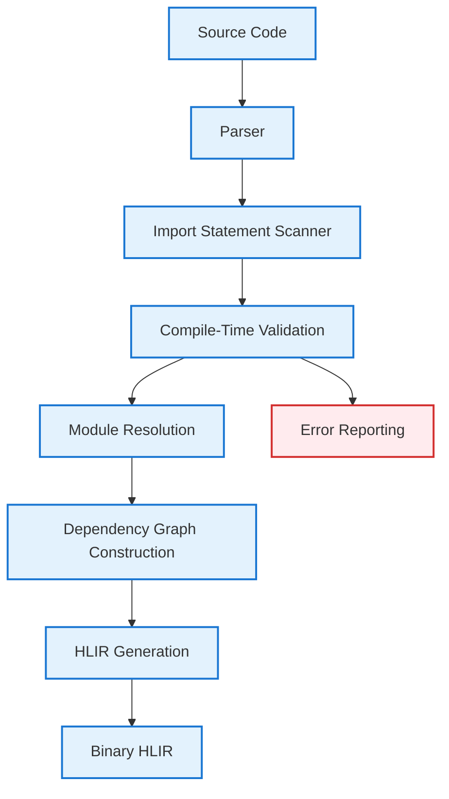
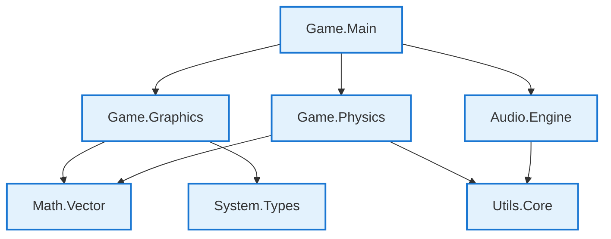

# GameVM Modules

## Overview

GameVM modules are the fundamental compilation units that bridge language-specific source code with the language-agnostic HLIR (High-Level Intermediate Representation). Each module represents a single source file that can be independently compiled and consumed across different programming languages through the universal HLIR ABI.

## Module Lifecycle

### 1. Source Definition
```
Language-Specific Source Files
├── Game.Graphics.pas        # Pascal source
├── Math.Vector.cpp          # C++ source
├── Audio.Mixer.cs           # C# source
└── Utils.Logging.java       # Java source
```

### 2. HLIR Transformation
```
Source Files → Language Frontend → HLIR Modules
├── Game.Graphics.hlirm      # HLIR module
├── Math.Vector.hlirm        # HLIR module
├── Audio.Mixer.hlirm        # HLIR module
└── Utils.Logging.hlirm      # HLIR module
```

### 3. Binary Compilation
```
HLIR Modules → HLIR Compiler → Binary HLIR
├── Game.Graphics.hlirb      # Binary HLIR
├── Math.Vector.hlirb        # Binary HLIR
├── Audio.Mixer.hlirb        # Binary HLIR
└── Utils.Logging.hlirb      # Binary HLIR
```

### 4. Library Assembly
```
Binary HLIR → Library Linker → Libraries
├── Game.Graphics.hlirl      # Graphics library
├── Audio.Engine.hlirl       # Audio library
└── Utils.Core.hlirl         # Utilities library
```

### 5. Package Distribution
```
Libraries → Packager → Packages
└── Game.Engine-1.0.0.pkg    # Distribution package
```

## Module Structure

### Source Module Definition

Each source file defines a module with explicit boundaries:

#### Pascal Example
```pascal
unit Game.Graphics;

interface

uses
  Math.Vector, System.Types;

type
  TSprite = class
  private
    FPosition: TVector2;
    FTexture: PTexture;
  public
    constructor Create(APosition: TVector2);
    procedure Draw;
    property Position: TVector2 read FPosition write FPosition;
  end;

implementation

constructor TSprite.Create(APosition: TVector2);
begin
  FPosition := APosition;
end;

procedure TSprite.Draw;
begin
  // Drawing implementation
end;

end.
```

#### C++ Example
```cpp
// Math/Vector.h
#pragma once
#include <cstdint>

namespace Math {
    class Vector2 {
    public:
        float x, y;
        
        Vector2(float x = 0.0f, float y = 0.0f);
        float Length() const;
        Vector2 Normalize() const;
        
        Vector2 operator+(const Vector2& other) const;
        Vector2 operator-(const Vector2& other) const;
        Vector2 operator*(float scalar) const;
    };
}
```

#### C# Example
```csharp
// Audio/Mixer.cs
using System;

namespace Audio {
    public class Mixer {
        private float masterVolume = 1.0f;
        
        public float MasterVolume {
            get => masterVolume;
            set => masterVolume = Math.Clamp(value, 0.0f, 1.0f);
        }
        
        public void MixChannels(float[] leftChannel, float[] rightChannel) {
            // Mixing implementation
        }
        
        public void ApplyEffects(float[] buffer, EffectType effect) {
            // Effect implementation
        }
    }
}
```

### HLIR Module Representation

After compilation, each source module becomes a language-agnostic HLIR module:

```typescript
interface HLIRModule {
    // Module identity
    name: string;                // e.g., "Game.Graphics"
    sourceFile: string;          // Original source file path
    language: string;            // Source language (pascal, cpp, csharp, etc.)
    version: string;             // Module version
    
    // Public interface
    exports: HLIRExport[];       // Publicly available entities
    imports: HLIRImport[];       // Module dependencies
    
    // Semantic entities
    types: Map<string, HLIRType>;          // Type definitions
    functions: Map<string, HLIRFunction>;  // Function definitions
    constants: Map<string, HLIRConstant>;  // Compile-time constants
    variables: Map<string, HLIRVariable>;  // Global variables
    
    // Metadata
    metadata: {
        author?: string;
        license?: string;
        description?: string;
        keywords?: string[];
        targetRequirements?: TargetRequirements;
    };
    
    // Compilation context
    sourceMap: SourceMap;        // Debug information
    compilationOptions: CompilationOptions;
}
```

### Module Naming Conventions

#### File Path to Module Name Mapping
| Source File                  | Language | Module Name         |
| ---------------------------- | -------- | ------------------- |
| `src/Game/Graphics.pas`      | Pascal   | `Game.Graphics`     |
| `src/Math/Vector.cpp`        | C++      | `Math.Vector`       |
| `src/Audio/Mixer.cs`         | C#       | `Audio.Mixer`       |
| `src/com/example/Utils.java` | Java     | `com.example.Utils` |
| `src/utils/logging.py`       | Python   | `utils.logging`     |
| `src/game/input.lua`         | Lua      | `game.input`        |

#### Naming Rules
1. **Hierarchical**: Use dots (.) to separate logical components
2. **Case-sensitive**: Preserve source language case conventions
3. **Unique**: Module names must be unique within the dependency graph
4. **Descriptive**: Names should clearly indicate purpose and scope

## Module Boundaries

### Exports

Modules explicitly declare what they make available to other modules:

#### Explicit Exports
```pascal
// Pascal
unit Game.Graphics;

interface

// Public types
type
  TSprite = class;
  TTexture = class;

// Public functions
function CreateSprite(X, Y: Integer): TSprite;
function LoadTexture(Filename: string): TTexture;

// Public variables
var
  DefaultRenderer: TRenderer;

implementation
// Implementation details
end.
```

```cpp
// C++
// Math/Vector.h
namespace Math {
    // Public classes
    class Vector2;
    class Vector3;
    
    // Public functions
    float DotProduct(const Vector2& a, const Vector2& b);
    Vector2 Normalize(const Vector2& v);
}
```

#### HLIR Export Representation
```typescript
exports: [
    {
        name: "TSprite",
        kind: "type",
        visibility: "public",
        internalName: "Game.Graphics.TSprite"
    },
    {
        name: "CreateSprite", 
        kind: "function",
        visibility: "public",
        signature: {
            parameters: [{name: "X", type: "i32"}, {name: "Y", type: "i32"}],
            returnType: "Game.Graphics.TSprite"
        }
    }
]
```

### Imports

Modules declare their dependencies explicitly using compile-time resolvable imports:

#### Language-Specific Import Syntax
```pascal
// Pascal
uses
  Math.Vector,    // Import entire module
  System.Types in TTypes;  // Import with alias
  Audio.Mixer;    // Import specific module
```

```cpp
// C++
#include "Math/Vector.h"    // Import module
#include "System/Types.h"   // Import module
using namespace System;    // Import namespace
```

```csharp
// C#
using Math.Vector;          // Import namespace
using static Math.Vector;    // Import static members
using TTypes = System.Types; // Import with alias
```

#### Compile-Time Import Restrictions

GameVM only supports compile-time resolvable module imports. All require/import statements must use string literals or compile-time constants. This ensures the full dependency graph is known to the compiler, enabling cross-module optimization and dead code elimination.

**Note on Dynamic Loading**: While the *dependency graph* must be static, the actual *loading* of these modules into memory can be deferred to runtime on systems with slow media or RAM constraints. See [Dynamic Loading](DynamicLoading.md) for details on relocatable modules and overlays.

##### Allowed (Compile-Time Resolvable)
```lua
-- String literals
local graphics = require("game.graphics")
local audio = require("audio.engine")

-- Compile-time constants
local graphics = require(GRAPHICS_MODULE)  -- Defined at compile time
local backend = require(select_backend())  -- CTFE function

-- Concatenation of compile-time literals
local module = "game.graphics." .. GRAPHICS_TYPE  -- If GRAPHICS_TYPE is compile-time constant
```

##### Dynamic Module Resolution

While GameVM is a compiled system, it supports dynamic module resolution (common in Python, Lua, and Ruby) through two primary mechanisms. These are handled as wrappers around the [Dynamic Loading](DynamicLoading.md) system.

##### 1. The Module Registry (Cartridge/Resident)
For systems where all code must reside in the primary ROM, the compiler generates a **Module Registry**.
*   **Discovery**: The compiler identifies all modules included in the project.
*   **Registry Generation**: A static, sorted table of `Name (String) -> Export Table (Pointer)` is embedded in the binary.
*   **Resolution**: `import(name_var)` performs a binary search in the registry and returns the Module Object.

##### 2. The ELF Loader (Disk/Network)
For systems with slow media, dynamic resolution uses the file system.
*   **Mapping**: `import("level_" + id)` maps to a file reference (e.g., `LEVEL_1.ELF`).
*   **Loading**: The runtime invokes the **ELF Loader** to pull the module into RAM and relocate it.
*   **Resolution**: Returns a handle to the newly loaded and bound module.

#### Implementation: Module Objects
A dynamically resolved module is returned as a **Module Object** (a struct of function pointers). Calls to the module are dispatched via this Vtable, ensuring that once the module is resolved, execution remains high-performance.

```python
# Python example in GameVM
mod_name = "graphics_" + system_type
gfx = __import__(mod_name) # Looks up in Registry or loads ELF
gfx.draw_sprite(x, y)      # Dispatched via Vtable pointer
```

#### Compiler Constraints
To prevent ROM bloat, the compiler may require explicit declaration of "Dynamic Candidates" in the project configuration:
```yaml
# gamevm.yaml
dynamic_resolution:
  - modules: ["enemies.*", "levels.level_*"] # Only these modules are registered/emitted as ELF
```

#### HLIR Import Representation
```typescript
imports: [
    {
        module: "Math.Vector",
        members: [],  // Empty = import entire module
        version: "^1.2.0",
        resolvedAt: "compile-time"
    },
    {
        module: "System.Types", 
        members: ["TPoint", "TRect"],  // Specific imports
        alias: "TTypes",
        version: "~1.0.0",
        resolvedAt: "compile-time"
    }
]
```

#### Compiler Validation

The GameVM compiler validates all import statements during compilation:

```typescript
interface ImportValidation {
    validateImport(
        statement: ImportStatement,
        context: CompilationContext
    ): ValidationResult;
    
    isCompileTimeConstant(expression: Expression): boolean;
    resolveModuleAtCompileTime(
        moduleName: string,
        context: CompilationContext
    ): ResolvedModule;
}
```

#### Error Handling
```lua
-- Compile-time error examples
local graphics = require(runtime_variable)  -- Error: Runtime variable not allowed

-- Compiler output:
-- Error: require() argument must be string literal or compile-time constant
--   at line 42: require(runtime_variable)
--   'runtime_variable' is not a compile-time constant

local graphics = require("nonexistent.module")  -- Error: Module not found

-- Compiler output:
-- Error: Module 'nonexistent.module' not found
--   at line 42: require("nonexistent.module")
--   Available modules: game.graphics, audio.engine, system.utils
```

#### Alternative Patterns for Dynamic Needs

For scenarios that might seem to require dynamic module loading, GameVM provides compile-time alternatives:

##### CTFE-Based Selection
```lua
-- Use CTFE for compile-time selection
@ctfe
function select_graphics_module()
    if TARGET_PLATFORM == "atari2600" then
        return "graphics.tia"
    else
        return "graphics.software"
    end
end

local graphics = require(ctfe_eval(select_graphics_module()))
```

##### Feature Flags
```lua
-- Use compile-time constants
local graphics = require(
    ENABLE_ADVANCED_GRAPHICS and "graphics.advanced" or "graphics.basic"
)
```

##### Factory Pattern (Runtime Selection)
```lua
-- Load all possible modules at compile time
local graphics_basic = require("graphics.basic")
local graphics_advanced = require("graphics.advanced")

-- Select at runtime (no module loading)
local function create_graphics(advanced)
    if advanced then
        return graphics_advanced.new()
    else
        return graphics_basic.new()
    end
end
```

## Cross-Language Interoperability

### Universal ABI

HLIR serves as the universal Application Binary Interface (ABI) that enables seamless cross-language interoperability:

#### Type System Unification
| Language Type    | HLIR Type  | Description           |
| ---------------- | ---------- | --------------------- |
| Pascal `Integer` | `i32`      | 32-bit signed integer |
| C++ `float`      | `f32`      | 32-bit floating point |
| C# `string`      | `string`   | Unicode string        |
| Java `boolean`   | `bool`     | Boolean value         |
| Python `list`    | `array<T>` | Generic array         |

#### Function Calling Convention
All languages use the same HLIR calling convention:
```typescript
// Universal function signature
{
    name: "AddVectors",
    parameters: [
        {name: "a", type: "Math.Vector2"},
        {name: "b", type: "Math.Vector2"}
    ],
    returnType: "Math.Vector2",
    callingConvention: "hlir_std"
}
```

### Cross-Language Usage Examples

#### C# Consuming Pascal Module
```csharp
// C# code using Pascal-compiled module
using Game.Graphics;

class Player {
    private Sprite sprite;
    
    public Player(float x, float y) {
        // Call Pascal function from C#
        sprite = CreateSprite(x, y);
    }
    
    public void Draw() {
        // Call Pascal method from C#
        sprite.Draw();
    }
}
```

#### Java Consuming C++ Module
```java
// Java code using C++-compiled module
import Math.Vector2;

class PhysicsBody {
    private Vector2 position;
    private Vector2 velocity;
    
    public PhysicsBody(float x, float y) {
        // Call C++ constructor from Java
        this.position = new Vector2(x, y);
        this.velocity = new Vector2(0, 0);
    }
    
    public void update(float deltaTime) {
        // Call C++ function from Java
        this.position = Vector2.Add(this.position, 
            Vector2.Multiply(this.velocity, deltaTime));
    }
}
```

## Module Compilation

### Compilation Pipeline

1. **Source Parsing**
   - Language-specific parser creates AST
   - Syntax validation and error reporting

2. **Import Resolution**
   - Validate all import statements are compile-time resolvable
   - Resolve module dependencies at compile time
   - Build dependency graph

3. **Semantic Analysis**
   - Type checking within module
   - Name resolution and scope analysis
   - Cross-module type validation

4. **HLIR Generation**
   - Transform AST to HLIR representation
   - Apply language-specific optimizations
   - Generate module metadata

5. **Binary Compilation**
   - Compile HLIR to binary format
   - Apply cross-module optimizations
   - Generate debug information

### Compile-Time Import Processing

The GameVM compiler processes all imports during compilation:



### Import Validation Rules

```typescript
interface ImportValidationRules {
    // String literals are always allowed
    isStringLiteral(expression: Expression): boolean;
    
    // Compile-time constants are allowed
    isCompileTimeConstant(expression: Expression): boolean;
    
    // CTFE function results are allowed
    isCTFEResult(expression: Expression): boolean;
    
    // Concatenation of compile-time values is allowed
    isCompileTimeConcatenation(expression: Expression): boolean;
    
    // Runtime variables are forbidden
    isRuntimeVariable(expression: Expression): boolean;
}
```

### Compilation Options

```json
{
    "target": "generic",
    "optimization": "speed",
    "debug": true,
    "rtti": true,
    "boundsChecking": true,
    "exceptions": true,
    "importValidation": "strict",
    "features": [
        "inlineAssembly",
        "superinstructions",
        "vectorOperations"
    ]
}
```

## Module Dependencies

### Dependency Graph

Modules form a directed acyclic graph (DAG) of dependencies:



### Version Constraints

Modules specify version constraints for their dependencies:

```json
{
    "imports": [
        {
            "module": "Math.Vector",
            "version": "^2.1.0",
            "reason": "Requires vector normalization feature"
        },
        {
            "module": "System.Types", 
            "version": "~1.5.0",
            "reason": "Compatible type definitions"
        }
    ]
}
```

### Circular Dependency Handling

GameVM prevents circular dependencies at compile time through import validation:

```pascal
// This will cause a compilation error
// ModuleA.pas
unit ModuleA;
uses ModuleB;  // A depends on B

// ModuleB.pas  
unit ModuleB;
uses ModuleA;  // B depends on A - CIRCULAR!
```

**Compiler Detection:**
```typescript
interface CircularDependencyDetector {
    detectCircularDependencies(
        dependencyGraph: DependencyGraph
    ): CircularDependency[];
    
    reportCircularDependency(
        cycle: Module[]
    ): CompilationError;
}
```

**Error Output:**
```
Error: Circular dependency detected
ModuleA → ModuleB → ModuleA
  ModuleA.pas:3: uses ModuleB;
  ModuleB.pas:3: uses ModuleA;
```

**Solutions:**
- **Refactor**: Extract common code into a third module
- **Interface segregation**: Split into smaller, focused modules
- **Dependency injection**: Use interfaces instead of direct dependencies

## Module Metadata

### Standard Metadata Fields

```typescript
interface ModuleMetadata {
    // Identity
    name: string;
    version: string;
    description?: string;
    
    // Authorship
    author?: string;
    license?: string;
    homepage?: string;
    
    // Classification
    keywords?: string[];
    category?: string;
    
    // Technical
    language: string;
    targetRequirements?: {
        minRomSize?: number;
        minRamSize?: number;
        requiredFeatures?: string[];
        optionalFeatures?: string[];
    };
    
    // Dependencies
    dependencies?: Record<string, string>;
    
    // Build
    buildDate: string;
    compilerVersion: string;
    compilationOptions: CompilationOptions;
}
```

### Custom Metadata

Modules can include custom metadata for specific use cases:

```json
{
    "name": "Game.Graphics",
    "version": "1.2.0",
    "custom": {
        "graphicsApi": "custom",
        "maxTextureSize": 256,
        "supportedFormats": ["png", "bmp"],
        "performanceProfile": "retro_optimized"
    }
}
```

## Module Testing

### Unit Testing

Modules can include embedded tests:

```pascal
unit Math.Vector;

interface

type
  TVector2 = record
    X, Y: Single;
  end;

function Add(const A, B: TVector2): TVector2;
function Length(const V: TVector2): Single;

implementation

// ... implementation ...

{$IFDEF TESTS}
procedure TestVectorOperations;
begin
  // Unit tests
  Assert(Length(Add(Vector2(1, 2), Vector2(3, 4))) = 7.07);
end;
{$ENDIF}

end.
```

### Integration Testing

Cross-language integration tests verify module interoperability:

```csharp
// C# test consuming Pascal module
[Test]
public void TestPascalVectorFromCSharp() {
    var v1 = new Vector2(3, 4);
    var v2 = new Vector2(1, 2);
    var result = Math.Vector.Add(v1, v2);
    
    Assert.AreEqual(4, result.X);
    Assert.AreEqual(6, result.Y);
}
```

## Best Practices

### Module Design Principles

1. **Single Responsibility**: Each module should have one clear purpose
2. **Minimal Dependencies**: Fewer dependencies = faster compilation
3. **Stable Interface**: Avoid breaking changes between versions
4. **Explicit Exports**: Clearly define public API
5. **Comprehensive Documentation**: Document all public entities

### Performance Considerations

1. **Module Size**: Keep modules focused and reasonably sized
2. **Import Granularity**: Import only what you need
3. **Compilation Time**: Minimize cross-module dependencies
4. **Runtime Loading**: Consider module loading order for dynamic scenarios

### Security Considerations

1. **Input Validation**: Validate all external inputs
2. **Memory Safety**: Follow language-specific memory safety guidelines
3. **Access Control**: Use appropriate visibility modifiers
4. **Code Signing**: Consider signing modules for distribution

## See Also

- [HLIR Design Document](HLIR.md) - High-level intermediate representation
- [Module Resolution System](ModuleResolution.md) - Dependency resolution and loading
- [Package Management Design](../architecture/PackageManagement.md) - Distribution and versioning
- [Language Integration Guide](LanguageIntegration.md) - Cross-language interoperability
- [Type System](TypeSystem.md) - Unified type system across languages