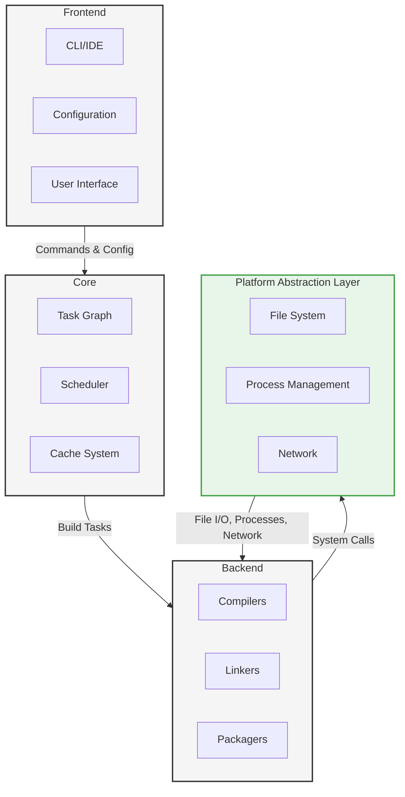

# GameVM Build System Design

## 1. Introduction

### 1.1 Purpose
This document outlines the design of GameVM's build system, which orchestrates the compilation and linking of modules across multiple languages for retro gaming console targets (2nd-5th generation).

### 1.2 Key Features
- Incremental compilation with precise dependency tracking
- Parallel build execution across all available cores
- Cross-language dependency resolution
- Cross-console compilation support
- Distributed build caching
- Integration with [Module System](./ModuleResolution.md) and [Type System](./TypeSystem.md)

### 1.3 Related Documents
- [Architecture Overview](./ArchitectureOverview.md)
- [Module Resolution](./ModuleResolution.md)
- [Type System](./TypeSystem.md)

## 2. Architecture

### 2.1 System Overview



### 2.2 Core Components

1. **Build Engine**
   - Task scheduling and parallel execution
   - Dependency graph management
   - Incremental build support
   - Distributed build coordination

2. **Module System Integration**
   - Resolves module dependencies
   - Handles cross-language references
   - Manages module metadata and versions
   - Integrates with [Module Resolution](./ModuleResolution.md)

3. **Toolchain Management**
   - Language compiler integration
   - Cross-compilation toolchains
   - Platform SDK management
   - Build artifact caching

## 3. Console Generation Support

### 3.1 Supported Console Generations

| Generation | Example Consoles       | Architecture | Toolchains          | Notes                          |
|------------|------------------------|--------------|---------------------|--------------------------------|
| 2nd Gen    | Atari 2600, Intellivision | 8-bit       | Custom toolchains   | Limited memory (4-16KB)        |
| 3rd Gen    | NES, Sega Master System | 8-bit       | Custom toolchains   | Tile-based graphics, sound chips |
| 4th Gen    | SNES, Sega Genesis     | 16-bit      | Custom toolchains   | Enhanced graphics, more memory |
| 5th Gen    | PlayStation, N64       | 32/64-bit   | Custom toolchains   | 3D capabilities, CD-based media |

### 3.2 Console-Specific Toolchains
- Generation-specific optimizations
- Memory layout configuration
- Hardware register access
- ROM/Flash memory mapping

## 4. Build Configuration

### 4.1 Project Configuration
```yaml
# gamevm.yaml
project:
  name: "my-game"
  version: "1.0.0"
  targets: ["nes", "snes", "genesis"]
  defaultTarget: "nes"

build:
  outputDir: "./roms"
  cacheDir: "./build/cache"
  clean: true
  
  # Optimization levels: debug, release, size, speed
  optimization: "size"  # Size is critical for retro consoles
  
  # Feature flags
  features:
    bank_switching: true  # For memory expansion
    save_states: false    # For debug builds
    debug_console: true   # Debug output to console

# Module configurations
modules:
  - name: "game.core"
    type: "library"
    path: "./core"
    targets: ["win32", "linux"]
    
  - name: "game.ui"
    type: "library"
    path: "./ui"
    dependsOn: ["game.core"]

# Toolchain configurations
toolchains:
  cc65:  # For 6502-based systems
    path: "/path/to/cc65"
    flags: ["-Oirs", "--add-source"]
    
  wla_dx:  # For Z80/65816 systems
    path: "/path/to/wla-dx"
    flags: ["-o"]

# Target-specific overrides
targets:
  nes:  # NES/Famicom
    mapper: 0  # NROM
    chr_rom_size: 8  # 8KB
    prg_rom_size: 32  # 32KB
    features:
      bank_switching: false
      
  snes:  # Super Nintendo
    map_mode: LoROM
    sram_size: 32  # 32KB
    rom_size: 4096  # 4MB
    
  genesis:  # Sega Genesis/Mega Drive
    vdp: 1  # NTSC
    sram_size: 64  # 64KB
```

### 4.2 Build Profiles

| Profile    | Optimizations | Debug Info | Assertions | Notes                                      |
|------------|---------------|------------|------------|--------------------------------------------|
| Debug      | -O0           | Full       | Enabled    | For development with debug output          |
| Dev        | -Os           | Line info  | Enabled    | Balanced debug/performance for testing     |
| Release    | -Os           | None       | Disabled   | For final ROM distribution (size-optimized)|
| Perf       | -O2           | None       | Disabled   | For performance testing (speed-optimized)  |
| Cartridge  | -Os           | None       | Disabled   | For burning to physical cartridges         |

### 4.3 Module Configuration Examples

#### 4.3.1 Game Logic Module
```yaml
modules:
  - name: game.logic
    type: static_lib
    language: c
    target: nes
    sources:
      - src/logic/*.c
    includes:
      - include/nes
    defines:
      - ENABLE_CHEATS  # For development only
    dependencies:
      - core.memory
```

#### 4.3.2 Audio Engine Module
```yaml
modules:
  - name: game.audio
    type: static_lib
    language: asm
    target: nes
    sources:
      - src/audio/*.asm
    includes:
      - include/nes
    defines:
      - USE_MMC5  # For MMC5 audio expansion
    resources:
      - sfx/*.wav  # Will be converted to DPCM
```

#### 4.3.3 Graphics Module
```yaml
modules:
  - name: game.gfx
    type: static_lib
    language: c
    target: snes
    sources:
      - src/gfx/*.c
    includes:
      - include/snes
    resources:
      - gfx/*.png  # Will be converted to SNES tile format
    defines:
      - MODE_224  # For hi-res mode
```

## 5. ROM Building Process

### 5.1 Build Phases
1. **Initialization**
   - Load console-specific configuration
   - Initialize retro toolchain (cc65, wla-dx, etc.)
   - Set up memory map and hardware registers

2. **Asset Processing**
   - Convert graphics to console-native format (CHR, VRAM, etc.)
   - Compress audio samples (DPCM, VGM, etc.)
   - Process level data and game resources

3. **Compilation**
   - Compile source files with console-specific flags
   - Apply size/speed optimizations based on profile
   - Generate symbol maps for debugging

4. **Linking**
   - Link object files with console-specific libraries
   - Apply memory map constraints
   - Generate iNES/SNES/Genesis ROM headers

5. **ROM Generation**
   - Combine code and assets into final ROM
   - Add checksums and copy protection
   - Generate .ips patches for distribution

## 6. ROM Optimization

### 6.1 Size Optimization
- Dead code elimination
- Unused asset removal
- Bank packing algorithms
- Compression for text and data

### 6.2 Performance Tuning
- Critical path optimization
- VBlank/NMI-safe code analysis
- Memory access pattern optimization
- ROM banking strategy

## 7. Console-Specific Features

### 7.1 Region Variants
```yaml
variants:
  ntsc:
    defines: ["NTSC"]
    timing: 60.0
    
  pal:
    defines: ["PAL"]
    timing: 50.0
    
  jp:
    defines: ["NTSC", "JAPAN"]
    timing: 60.0
    text_encoding: "shift_jis"
```

### 7.2 Custom Build Tools
```yaml
modules:
  - name: "game.levels"
    type: "data"
    tools:
      - name: "level-converter"
        command: "tools/level_conv -i $INPUT -o $OUTPUT"
        inputs: ["levels/*.tmx"]
        outputs: ["build/levels/*.bin"]
    
  - name: "game.sfx"
    type: "audio"
    target: "nes"
    tools:
      - name: "wav2dmc"
        command: "tools/wav2dmc -f $INPUT -o $OUTPUT -r 16500"
        inputs: ["sfx/*.wav"]
        outputs: ["build/sfx/*.dmc"]
```

## 8. Module System Integration

### 8.1 Build-Time Module Resolution
1. **Dependency Collection**
   - Parse module manifests
   - Build dependency graph
   - Detect version conflicts

2. **Cross-Language Dependencies**
   - Type mapping between languages
   - ABI compatibility checks
   - Interface definition sharing

### 8.2 Module Build Hooks

#### 8.2.1 Pre/Post Build Steps
```yaml
modules:
  - name: game.assets
    build:
      pre_build:
        - command: asset_compiler
          args: [--input, assets/, --output, ${OUT_DIR}]
      post_build:
        - command: package_assets
          args: [--input, ${OUT_DIR}, --output, ${TARGET_DIR}/data.pak]
```

#### 8.2.2 Custom Build Rules
```yaml
modules:
  - name: game.shaders
    type: custom
    build:
      rules:
        - pattern: "src/**/*.glsl"
          command: glslc
          args: 
            - -o
            - ${OUT_DIR}/${FILENAME}.spv
            - ${INPUT}
          outputs:
            - ${OUT_DIR}/${FILENAME}.spv
```

### 7.1 Build Hooks
- Pre-build
- Post-build
- Pre-link
- Post-link

### 7.2 Module-Specific Build Rules
```yaml
modules:
  - name: "game.scripting"
    build:
      preprocess:
        command: "lua-preprocessor"
        args: ["-o", "${out}", "${in}"]
      compiler: "luac"
      flags: ["-s", "-o", "${out}"]
```

## 9. Performance Optimization

### 9.1 Parallel Builds
- File-level parallelism
- Module-level parallelism
- Distributed build clusters

### 9.2 Caching Strategies

#### 9.2.1 Local Cache
```yaml
build:
  cache:
    enabled: true
    directory: ${HOME}/.cache/gamevm
    strategy: content_hash
    max_size: 10GB
```

#### 9.2.2 Remote Cache
```yaml
build:
  cache:
    remote:
      url: https://build-cache.example.com
      auth_token: ${CACHE_AUTH_TOKEN}
      push: ${CI}  # Only push in CI
```

### 9.3 Build Analysis
- Critical path visualization
- Bottleneck detection
- Resource usage monitoring

### 8.1 Parallelism
- Module-level parallel compilation
- File-level parallel processing
- Distributed build support

### 8.2 Caching Strategy
- Content-addressable storage
- Remote build cache
- Cache pruning policies

## 10. Security

### 10.1 Sandboxing
- Isolated build environments
- Restricted filesystem access
- Network access controls
- Capability-based security

### 10.2 Reproducible Builds
- Deterministic output
- Build environment isolation
- Dependency pinning
- Build manifest signing

### 9.1 Sandboxing
- Isolated build environments
- Restricted filesystem access
- Network access controls

## 11. IDE Integration

### 11.1 Project Generation
- Visual Studio solutions
- Xcode projects
- VSCode workspace
- CLion project

### 11.2 Development Tools
- Code completion
- Debugging support
- Profiling integration
- Test runners

## 12. Continuous Integration

### 12.1 CI Configuration
```yaml
# .github/workflows/build.yml
name: Build
on: [push, pull_request]

jobs:
  build:
    runs-on: ${{ matrix.platform }}
    strategy:
      matrix:
        platform: [ubuntu-latest, windows-latest, macos-latest]
    steps:
      - uses: actions/checkout@v3
      - uses: gamevm/setup@v1
      - run: gamevm build --profile=ci
      - uses: actions/upload-artifact@v3
        with:
          name: build-output
          path: dist/
```

## 13. Troubleshooting

### 13.1 Common Issues
- Dependency conflicts
- Toolchain detection
- Platform-specific quirks
- Performance bottlenecks

### 13.2 Debugging Builds
- Verbose logging
- Dependency graph export
- Build step tracing
- Cache diagnostics

## 14. Future Directions
- Cloud-based distributed builds
- Machine learning for build optimization
- Advanced incremental compilation
- Cross-language LTO (Link Time Optimization)

## 15. References
1. [Module Resolution](./ModuleResolution.md)
2. [Type System](./TYPE_SYSTEM.md)
3. [Architecture Overview](./ARCHITECTURE_OVERVIEW.md)

## Changelog

### [2.0.0] - 2025-09-16
- Major update with module system integration
- Added platform support matrix
- Enhanced build configuration options

### [1.0.0] - 2025-08-01
- Initial version
