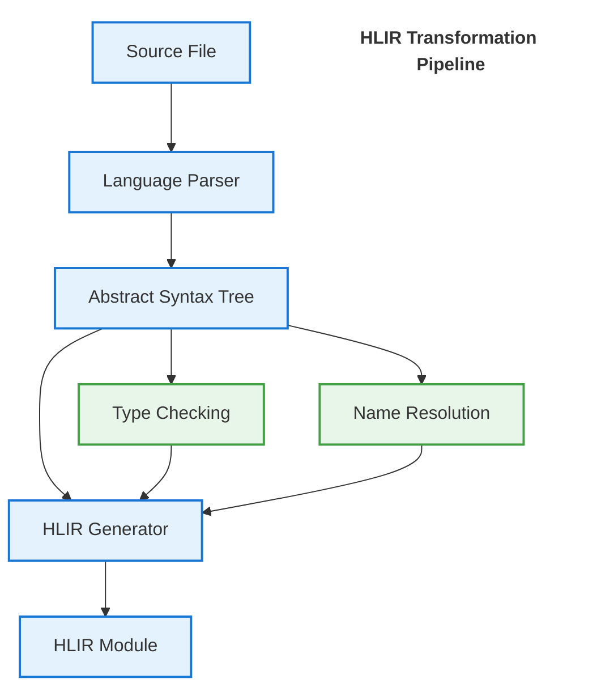
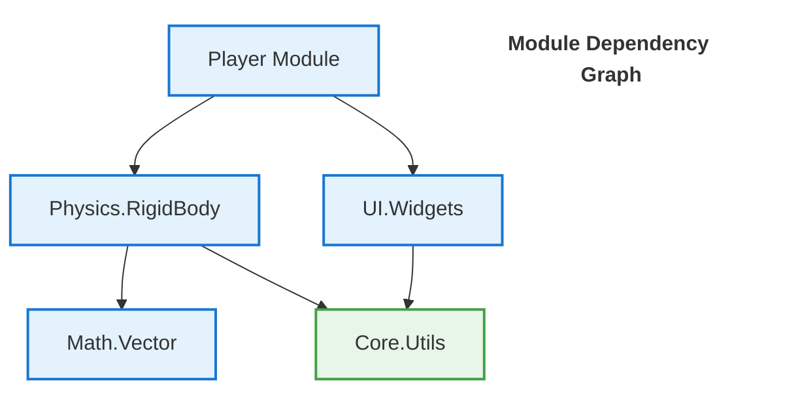

# GameVM Module Resolution System Design

## 1. Introduction

### 1.1 Purpose
This document outlines the design of GameVM's unified module resolution system, which enables seamless integration of modules across multiple programming languages through a canonical [High-Level Intermediate Representation (HLIR)](./HLIR.md). The system implements a language-agnostic approach to dependency management, type resolution, and ABI compliance, providing a robust foundation for polyglot development.

### 1.2 Key Features
- **Unified HLIR as Canonical Source of Truth**: All languages compile to a single, language-agnostic HLIR with a unified type system
- **Centralized ABI Management**: Eliminates the need for per-language ABI implementations
- **Structured Dependency Graph**: Enables precise analysis and optimization across language boundaries
- **Compiler-Native Resolution**: Moves beyond text-based includes to semantic dependency tracking

### 1.3 Scope
- Module discovery and resolution
- Cross-language dependency management
- Version conflict resolution
- Build system integration
- Development tooling support

### 1.4 Related Documents
- [Architecture Overview](./ArchitectureOverview.md)
- [Type System](./TypeSystem.md)
- [Build System](./BuildSystem.md)

## 2. Architecture Overview

### 2.3 Module Lifecycle

1. **Module Definition**
   - Source files with explicit module declarations
   - Language-specific module metadata
   - Dependencies and exports

2. **Compilation**
   - Source → HLIR transformation (see [HLIR Documentation](./HLIR.md))
   - Semantic analysis
   - Type checking across module boundaries

3. **Linking**
   - Resolution of cross-module references
   - Symbol binding
   - Dead code elimination

4. **Loading**
   - Dynamic module loading
   - Runtime linking
   - Dependency injection

### 2.1 Core Principles

1. **Language-Agnostic HLIR**
   - Single source of truth for types and interfaces
   - Unified memory model and ABI
   - Platform-independent representation

2. **Structured Dependency Graph**
   - Semantic understanding of module relationships
   - Support for fine-grained dependency tracking
   - Enables whole-program optimization

3. **Compiler-Native Resolution**
   - Moves beyond text inclusion to semantic resolution
   - Supports both static and dynamic linking models
   - Enables precise dependency analysis

### 2.2 Core Components

1. **HLIR Compiler**
   - Converts source modules to canonical HLIR
   - Manages type system unification
   - Handles ABI compliance

2. **Dependency Resolver**
   - Constructs and analyzes module dependency graph
   - Implements hybrid resolution algorithm
   - Handles version constraints and conflicts

3. **Module Loader**
   - Manages module lifecycle
   - Handles dynamic loading and linking
   - Maintains module cache

## 3. Module Representation

### 3.3 Example: Multi-Language Module

#### C++ Module (`math/vector.h`)
```cpp
#pragma once
#include <cstdint>

namespace Math {
    class Vector2 {
    public:
        Vector2(float x, float y);
        float Length() const;
        
        float x, y;
    };
}
```

#### Corresponding HLIR Module
```typescript
{
    name: 'Math.Vector',
    sourceFile: 'math/vector.h',
    types: {
        'Vector2': {
            kind: 'struct',
            fields: [
                { name: 'x', type: 'f32' },
                { name: 'y', type: 'f32' }
            ],
            methods: [
                { name: 'Length', returnType: 'f32', params: [] }
            ]
        }
    },
    imports: [],
    exports: ['Vector2']
}
```

### 3.1 HLIR as the Universal Intermediate

HLIR serves as the common intermediate representation for all source languages, enabling seamless cross-language interoperability. The transformation to HLIR occurs as the first compilation step after language-specific parsing.

#### Key Properties of HLIR:
- **Language-Agnostic**: Represents concepts common across all supported languages
- **Complete Semantics**: Includes both declarations and implementations
- **Type-Rich**: Maintains full type information for all entities
- **Location-Aware**: Preserves source mapping for debugging

#### Transformation Pipeline:



For C/C++, the HLIR generation includes:
1. Header parsing and semantic analysis
2. Extraction of public declarations
3. Generation of module interface
4. Integration with implementation units

```typescript
interface HLIRModule {
    // Module identity
    name: string;                // Logical module name (e.g., 'Game.Graphics')
    sourceFile: string;          // Path to source file
    
    // Semantic entities (all names are relative to module)
    types: Map<string, HLIRType>;          // Type definitions
    functions: Map<string, HLIRFunction>;  // Function signatures
    constants: Map<string, HLIRConstant>;  // Compile-time constants
    
    // Module boundaries
    imports: HLIRImport[];        // Explicit module dependencies
    exports: Set<string>;        // Publicly visible entities (qualified names)
    
    // Compilation context
    sourceMap: SourceMap;        // Maps HLIR entities to source locations
    language: string;            // Source language
    version: string;             // Module version (if applicable)
}

interface HLIRImport {
    module: string;              // Canonical module name
    members: string[];           // Specific imports (empty for module import)
    version: string;             // Version constraint
}

interface HLIRExport {
    name: string;                // External name
    internalName: string;        // Internal name (if different)
    kind: 'type' | 'function' | 'variable';
    visibility: 'public' | 'package' | 'protected' | 'private';
}
```

### 3.2 Language Integration

Each language frontend is responsible for mapping its native module system to the canonical HLIR format:

| Language  | Module Concept      | HLIR Mapping Strategy                     |
|-----------|---------------------|------------------------------------------|
| C         | Header/Source       | Semantic analysis of declarations        |
| C++       | Header/Source/Modules | AST transformation to HLIR               |
| C#        | Assemblies/Namespaces| Metadata-based extraction                |
| Java      | Packages/Classes    | Class file parsing                       |
| Pascal    | Units               | Direct mapping to HLIR modules            |
| Lua       | Modules/Tables      | Runtime module analysis                  |

### 3.2 Module Structure

A module is a single, self-contained source file that can be independently compiled. The module system treats each source file as a distinct module with a logical name derived from its file path and language conventions.

#### 3.2.1 Module Identification and Header Handling

- **Module Naming Rules**:
  - Pascal: `Game.Graphics.pas` → `Game.Graphics`
  - C#: `Game/Graphics.cs` → `Game.Graphics` (from namespace)
  - C/C++: `Game/Graphics.h` or `Game/Graphics.hpp` → `Game.Graphics`
  - Java: `com/example/Graphics.java` → `com.example.Graphics`
  - JavaScript: `game/graphics.js` → `game.graphics`
  - Python: `game/graphics.py` → `game.graphics`
  - Lua: `game/graphics.lua` → `game.graphics`

- **C/C++ Special Handling**:
  - Headers (`.h`, `.hpp`) and source files (`.c`, `.cpp`, `.cc`) map to the same module
  - `#include "Game/Graphics.h"` and `#include <Game/Graphics>` resolve to the same module
  - The GameVM preprocessor normalizes all include paths to their canonical module names
  - Public declarations are extracted from headers during HLIR generation

- **Dependency Resolution**:
  All language-specific import mechanisms are normalized to HLIR module references during compilation:
  
  ```pascal
  // Pascal: Units map directly to HLIR modules
  uses Game.Math, System.IO;  // → HLIR: [Game.Math, System.IO]
  
  // C#: Namespaces map to module prefixes
  using Game.Math;  // → HLIR: Game.Math.*
  
  // C/C++: Headers map to modules, includes are normalized
  #include <Game/Math.h>      // → HLIR: Game.Math
  #include "../Math/Vector.h" // → HLIR: Math.Vector (after path resolution)
  
  // Java: Packages map to module hierarchy
  import com.example.math.Vector2;  // → HLIR: com.example.math.Vector2
  
  // JavaScript/TypeScript: Paths are resolved to module names
  import { Vector2 } from './math.js';  // → HLIR: [current_package].math.Vector2
  
  // Python: Module paths map to dot notation
  from game.math import Vector2  // → HLIR: game.math.Vector2
  
  // Lua: require paths are normalized
  local math = require 'game.math'  // → HLIR: game.math
  ```

- **HLIR Module Unification**:
  - All language constructs are lowered to a common set of HLIR primitives
  - Module interfaces are extracted and made available for cross-language use
  - The resolver maintains a global module namespace with versioning support

#### 3.2.2 Module Naming and Resolution

1. **Module Naming**:
   - Derived from file path and language rules
   - Case-sensitive to match source language requirements
   - Dots (.) separate logical name components
   - Example mappings:
     - `src/Game/Graphics.pas` → `Game.Graphics`
     - `src/physics/rigid_body.cpp` → `physics.rigid_body`

2. **Entity Qualification**:
   - All entities are qualified by their module name in the HLIR
   - Examples:
     ```
     // HLIR Canonical Form
     Game.Graphics.Vector2
     com.example.physics.RigidBody
     game.math.Vector2
     
     // Language-specific references
     // Pascal: UnitName.Identifier
     // C++: namespace::Identifier
     // Java: package.Class
     // Python: module.attribute
     // JavaScript: import { name } from 'module'
     // Lua: require 'module'
     ```
   - Local names can be used without qualification within their module

3. **Build Configuration**:
```yaml
# gamevm.yaml
sources:
  # Pascal
  - path: src/Game/Graphics.pas  # Module: Game.Graphics
    language: pascal
    target: library
    
  # C++
  - path: src/physics/rigid_body.cpp  # Module: physics.rigid_body
    language: cpp
    target: static_lib
    
  # C#
  - path: src/Game/UI/Window.cs  # Module: Game.UI.Window
    language: csharp
    target: library
    
  # Java
  - path: src/main/java/com/example/Game.java  # Module: com.example.Game
    language: java
    target: jar
    
  # JavaScript/TypeScript
  - path: src/game/physics.js  # Module: game.physics
    language: javascript
    target: esmodule
    
  # Python
  - path: src/game/__init__.py  # Module: game
    language: python
    target: package
    
  # Lua
  - path: src/game/input.lua  # Module: game.input
    language: lua
    target: library

# Global settings
build:
  output: ./build
  includePaths:
    - ./include
  defines:
    - DEBUG
```
    target: library
    
  - name: Game.Math
    path: ./libs/Game.Math
    language: csharp
    target: library

# Shared build settings
build:
  output: ./bin
  includePaths:
    - ./include
    - ./libs
```

This approach keeps modules lightweight and language-native while still supporting the full build and dependency management pipeline.

## 4. Resolution Process

### 4.1 Example: Resolving Dependencies

#### 4.1.1 Module A (`game/physics/rigidbody.h`)
```c
#include "math/vector.h"

class RigidBody {
    Math::Vector2 position;
    Math::Vector2 velocity;
    
public:
    void Update(float deltaTime);
};
```

#### 4.1.2 Module B (`game/player.h`)
```c
#include "physics/rigidbody.h"

class Player {
    RigidBody physicsBody;
    // ...
};
```

#### 4.1.3 Resolution Steps
1. Parse `player.h`
2. Find `physics/rigidbody.h`
3. Resolve `math/vector.h`
4. Build dependency graph:



5. Process in dependency order (bottom-up):
   1. Compile `Core.Utils`
   2. Compile `Math.Vector`
   3. Compile `Physics.RigidBody`
   4. Compile `UI.Widgets`
   5. Compile `Player` module
   3. Compile `Player`

### 4.1 Module Discovery and Resolution

1. **Source Analysis**
   - Parse source files to extract:
     - Module name and version
     - Exported entities (types, functions, constants)
     - Imported module references
   - Build a module dependency graph
   - Resolve all references to semantic entities

2. **Hybrid Resolution Algorithm**
   - **Breadth-First Search (BFS)**: For initial traversal
   - **Semantic Versioning**: For version conflict resolution
   - **Nearest-First Rule**: For duplicate module resolution
   - **Dependency Skipping**: For performance optimization

3. **Dependency Graph Construction**
   - Build a complete graph of module dependencies
   - Detect and handle circular dependencies
   - Optimize for parallel compilation

### 4.2 Dependency Resolution

1. **Dependency Graph Construction**
   - Build a directed acyclic graph (DAG) of dependencies
   - Detect and handle cycles
   - Support for peer dependencies

2. **Version Resolution**
   - Semantic versioning (semver) compliance
   - Version constraint solving
   - Lock file generation for reproducible builds

### 4.3 Path Resolution

1. **Import Resolution Rules**
   - Language-specific import/require/include directives
   - Relative and absolute imports
   - Module name to path resolution

2. **Search Paths**
   - Module-local paths
   - Project-level paths
   - System paths
   - Language-specific paths

## 5. Cross-Language Support

### 5.3 Example: Cross-Language Module Usage

#### C# Consumer
```csharp
// Reference the generated Game.Physics module
using Game.Physics;

class Game {
    void Update() {
        var body = new RigidBody();
        body.Position = new Vector2(1.0f, 2.0f);
        float length = body.Position.Length();
    }
}
```

#### Type Mapping
| HLIR Type | C++            | C#             | Java           |
|-----------|----------------|----------------|----------------|
| `f32`     | `float`        | `float`        | `float`        |
| `Vector2` | `Math::Vector2`| `Vector2`      | `Vector2`      |
| `string`  | `std::string`  | `string`       | `String`       |

### 5.4 Performance Considerations
- Zero-copy interop for primitive types
- Pinning for managed-unmanaged transitions
- Batch operations for cross-language calls

### 5.1 Language Mappings

| Language   | Import Syntax          | File Extensions | Notes                     |
|------------|------------------------|-----------------|---------------------------|
| Pascal     | `uses Unit1, Unit2;`   | .pas, .pp, .p   | Case-insensitive          |
| C          | `#include "header.h"`  | .h, .c, .hpp    | Include path resolution   |
| C#         | `using Namespace;`     | .cs             | Assembly references       |
| Java       | `import package.Class` | .java           | Package path resolution   |
| Lua        | `require 'module'`     | .lua            | Package.path resolution   |

### 5.2 Type System Integration
- Map language-specific types to HLIR types
- Handle language-specific calling conventions
- Support for interop attributes/annotations

## 6. Build System Integration

### 6.1 Build Configuration Example

```yaml
# gamevm.yaml
modules:
  - name: Math.Vector
    path: src/math/vector
    language: cpp
    target: static_lib
    
  - name: Physics.RigidBody
    path: src/physics/rigidbody
    language: cpp
    target: static_lib
    dependsOn: [Math.Vector]
    
  - name: Game.Player
    path: src/game/player
    language: csharp
    target: library
    dependsOn: [Physics.RigidBody]
```

### 6.2 Build Process
1. **Dependency Analysis**
   - Load all module definitions
   - Build dependency graph
   - Detect cycles and version conflicts

2. **Parallel Compilation**
   - Compile independent modules in parallel
   - Cache compilation results
   - Handle cross-module optimizations

3. **Linking**
   - Generate final artifacts
   - Apply link-time optimizations
   - Create debug symbols and metadata

### 6.1 Build Configuration
```yaml
# gamevm.yaml
modules:
  - name: game.engine
    path: ./engine
    type: library
    build:
      target: native
      optimization: speed
      debug: true

  - name: game.editor
    path: ./editor
    type: application
    dependencies: [game.engine]

searchPaths:
  - ./lib
  - /usr/local/lib/gamevm
  - ${HOME}/.gamevm/packages

compiler:
  target: wasm
  features: [simd, threads]
```

### 6.2 Build Process
1. **Dependency Analysis**
   - Parse module manifests
   - Build dependency graph
   - Check for version conflicts

2. **Build Orchestration**
   - Determine build order
   - Parallel build where possible
   - Handle cross-language dependencies

3. **Output Generation**
   - Generate appropriate output format
   - Create debug information
   - Generate dependency metadata

## 7. Tooling Support

### 7.1 IDE Integration

#### 7.1.1 Code Navigation
- Jump to definition across languages
- Find all references
- Go to implementation

#### 7.1.2 Refactoring
- Rename symbols across language boundaries
- Extract method/interface
- Change signature

### 7.2 Debugging
- Mixed-language call stacks
- Cross-language watch windows
- Memory inspection across runtimes

## 8. Best Practices

### 8.1 Module Design
- Keep modules focused and cohesive
- Minimize cross-module dependencies
- Use clear, hierarchical naming

### 8.2 Performance
- Use value types for small, frequently used data
- Minimize cross-language calls in hot paths
- Batch operations when possible

### 8.3 Testing
- Test modules in isolation
- Verify cross-language behavior
- Include performance benchmarks

## 9. Future Extensions
- Lazy loading of modules
- Dynamic code generation
- Hot reload support
- Cross-platform ABI stability

## 10. References
1. [GameVM Architecture](./ArchitectureOverview.md)
2. [Type System](./TypeSystem.md)
3. [Build System](./BuildSystem.md)

## Changelog

### [1.1.0] - 2025-09-16
- Added cross-language examples
- Improved documentation structure
- Added best practices section

### [1.0.0] - 2025-09-01
- Initial version

### 7.1 Command Line Interface
```bash
# Resolve and download dependencies
gamevm restore

# Build the project
gamevm build

# Add a dependency
gamevm add package@version

# List dependencies
gamevm list

# Update dependencies
gamevm update
```

### 7.2 IDE Integration
- Module-aware code completion
- Cross-language navigation
- Real-time dependency validation
- Build integration

## 8. Security Considerations

1. **Dependency Trust**
   - Package signing
   - Checksum verification
   - Vulnerability scanning

2. **Sandboxing**
   - Isolated build environments
   - Permission controls
   - Network access restrictions

## 9. Future Extensions

1. **Dynamic Loading**
   - Runtime module loading
   - Hot code reloading
   - Plugin systems

2. **Distribution**
   - Binary package distribution
   - Delta updates
   - CDN integration

3. **Advanced Features**
   - Conditional compilation
   - Feature flags
   - Build variants

## 10. Appendix

### 10.1 Example Module Structure
```
my-module/
├── module.json
├── src/
│   ├── main.pas
│   └── utils.pas
├── include/
│   └── my-module.h
└── tests/
    └── test_main.pas
```

### 10.2 Related Documents
- [HLIR Specification](./HLIR.md)
- [Build System Design](./BuildSystem.md)
- [Language Support Guidelines](./LanguageSupport.md)

## 11. Revision History

| Version | Date       | Description                     |
|---------|------------|---------------------------------|
| 1.0     | 2025-09-14 | Initial version                 |
| 1.1     | 2025-09-15 | Added security considerations   |
