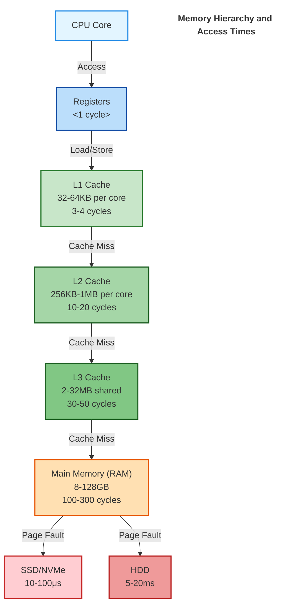

# Performance Guidelines for GameVM

## 1. Introduction

### 1.1 Purpose
This document provides guidelines and best practices for writing high-performance code in GameVM, ensuring consistent performance optimization approaches across all components.

### 1.2 Performance Philosophy
- **Measure First**: Profile before optimizing
- **Data-Oriented Design**: Optimize for cache efficiency
- **Minimize Allocations**: Reduce GC pressure
- **Parallelism**: Leverage multi-core systems
- **Platform Awareness**: Optimize for target hardware

### 1.3 Related Documents
- [Architecture Overview](./ArchitectureOverview.md)
- [Type System](./TypeSystem.md)
- [Testing Strategy](./TestingStrategy.md)

## 2. Performance Metrics

### 2.1 Key Performance Indicators

| Metric | Target | Measurement Method |
|--------|--------|-------------------|
| Frame Time | <16.6ms (60 FPS) | Frame profiler |
| Memory Usage | <80% of target | Memory profiler |
| Load Times | <2s initial load | Automated tests |
| CPU Usage | <70% per core | System monitor |
| GC Pauses | <1ms per frame | GC profiler |
| Compile Time | <30s incremental | Build system |

## 3. Data-Oriented Design

### 3.1 Data Layout

#### 3.1.1 Structure of Arrays (SoA)

```mermaid
graph TD
    %% Array of Structs (AoS)
    subgraph AoS["Array of Structs (AoS)"]
        direction TB
        A1["Particle[0]: {position, velocity, color, size}"]
        A2["Particle[1]: {position, velocity, color, size}"]
        A3["Particle[2]: {position, velocity, color, size}"]
        A4[...]
    end
    
    %% Structure of Arrays (SoA)
    subgraph SoA["Structure of Arrays (SoA)"]
        direction TB
        B1["positions[]: Vector3"]
        B2["velocities[]: Vector3"]
        B3["colors[]: Color"]
        B4["sizes[]: float"]
    end
    
    %% Connection
    AoS -->|"Less cache efficient\nfor per-field operations"| SoA
    
    %% Styling
    classDef aos fill:#ffebee,stroke:#f44336,stroke-width:2px,color:#333;
    classDef soa fill:#e8f5e9,stroke:#4caf50,stroke-width:2px,color:#333;
    
    class AoS aos;
    class SoA soa;
    
    %% Add a title
    classDef titleStyle fill:none,stroke:none,font-weight:bold,font-size:16px
    Title[Array of Structs (AoS) vs Structure of Arrays (SoA)]:::titleStyle
```

```cpp
// Instead of: Array of Structs (AoS)
struct Particle {
    Vector3 position;
    Vector3 velocity;
    Color color;
    float size;
};
std::vector<Particle> particles;  // Not cache-friendly for per-field operations

// Use: Structure of Arrays (SoA)
struct Particles {
    std::vector<Vector3> positions;  // Contiguous memory for positions
    std::vector<Vector3> velocities;
    std::vector<Color> colors;
    std::vector<float> sizes;
};
```

### 3.2 Cache Optimization



- **Cache Line Size**: 64 bytes (x86), 128 bytes (ARM)
- **Alignment**: Align data to cache line boundaries
- **Prefetching**: Use compiler hints for data prefetching

## 4. Memory Management

### 4.1 Allocation Strategies

#### 4.1.1 Object Pools
```csharp
public class ObjectPool<T> where T : new()
{
    private readonly Stack<T> _pool = new Stack<T>();
    
    public T Get() => _pool.Count > 0 ? _pool.Pop() : new T();
    
    public void Return(T item) => _pool.Push(item);
}
```

### 4.2 Garbage Collection
- **Avoid**: Large object allocations in hot paths
- **Reuse**: Pool frequently allocated objects
- **Monitor**: Track GC pressure and collections

## 5. Parallelism

### 5.1 Task Parallelism
```cpp
// Parallel for loop
auto range = std::ranges::iota_view{0, (int)particles.size()};
std::for_each(std::execution::par, range.begin(), range.end(), [&](int i) {
    updateParticle(particles[i]);
});
```

### 5.2 Data Parallelism
- **SIMD Intrinsics**: Use platform-specific SIMD instructions
- **GPU Compute**: Offload parallel workloads to GPU

## 6. Language-Specific Optimizations

### 6.1 C++
- **Move Semantics**: Use `std::move` for large objects
- **constexpr**: Compile-time computation
- **Virtual Functions**: Minimize virtual calls in hot paths

### 6.2 C#
- **Structs**: Use for small, immutable data
- **Span<T>**: For high-performance array access
- **In Modifier**: For large readonly struct parameters

### 6.3 JavaScript/TypeScript
- **TypedArrays**: For numerical computations
- **WebAssembly**: Performance-critical code
- **Avoid**: Delete operator, with statement

## 7. I/O Performance

### 7.1 File I/O
- **Buffering**: Always use buffered I/O
- **Async**: Use asynchronous I/O for non-blocking operations
- **Memory Mapping**: For large files

### 7.2 Network I/O
- **Batching**: Combine small messages
- **Compression**: For large data transfers
- **Connection Pooling**: Reuse connections

## 8. Rendering Performance

### 8.1 Draw Call Optimization
- **Batching**: Combine draw calls
- **Instancing**: For repeated geometry
- **Level of Detail (LOD)**: Reduce geometry complexity at distance

### 8.2 Shader Optimization
- **Precision**: Use appropriate precision qualifiers
- **Branching**: Minimize in shaders
- **Texture Sampling**: Optimize texture access patterns

## 9. Performance Profiling

### 9.1 Profiling Tools
- **CPU**: VTune, Xcode Instruments, Perf
- **Memory**: Valgrind, Xcode Leaks, dotMemory
- **GPU**: RenderDoc, PIX, Xcode GPU Debugger

### 9.2 Benchmarking
```cpp
#include <benchmark/benchmark.h>

static void BM_StringCreation(benchmark::State& state) {
    for (auto _ : state) {
        std::string x("hello");
        benchmark::DoNotOptimize(x);
    }
}
BENCHMARK(BM_StringCreation);
```

## 10. Optimization Techniques

### 10.1 Loop Optimization
- **Hoisting**: Move loop-invariant code out
- **Unrolling**: Manual or compiler-guided
- **Fusion**: Combine multiple loops

### 10.2 Branch Prediction
- **Likely/Unlikely**: Use compiler hints
- **Branchless**: Use arithmetic instead of branches

## 11. Memory Access Patterns

### 11.1 Sequential Access
- **Prefetching**: Guide the prefetcher
- **Streaming**: Use non-temporal stores

### 11.2 Random Access
- **Cache-Friendly**: Organize data to minimize cache misses
- **Hashing**: Optimize hash functions for distribution

## 12. String Handling

### 12.1 String Operations
- **Views**: Use string_view (C++), Span<char> (C#)
- **Concatenation**: Pre-allocate when possible
- **Parsing**: Use specialized parsers for performance

## 13. Exception Handling

### 13.1 Performance Impact
- **Zero-Cost**: In some implementations
- **Expensive**: When exceptions are thrown
- **Alternatives**: Error codes, std::expected

## 14. Compiler Optimizations

### 14.1 Compiler Flags
- **Optimization Levels**: -O2, -O3, -Os
- **Link-Time Optimization (LTO)**: For whole-program optimization
- **Profile-Guided Optimization (PGO)**: For workload-specific optimization

## 15. Platform-Specific Optimizations

### 15.1 x86/x64
- **SIMD**: AVX, AVX2, AVX-512
- **CPU Dispatch**: Runtime CPU feature detection

### 15.2 ARM
- **NEON**: For SIMD operations
- **Big.LITTLE**: Consider core types for scheduling

## 16. Performance Anti-Patterns

### 16.1 Common Pitfalls
- **Premature Optimization**: Without profiling
- **Over-Parallelization**: Too much synchronization
- **False Sharing**: Threads modifying same cache line
- **Hidden Copies**: Unnecessary object copies

## 17. Performance Testing

### 17.1 Benchmarking Strategy
- **Baseline**: Establish performance baseline
- **Regression Testing**: Detect performance regressions
- **Load Testing**: Under realistic conditions

### 17.2 Continuous Performance Monitoring
- **CI Integration**: Automated performance tests
- **Telemetry**: Real-world performance data
- **Alerting**: On performance regressions

## 18. References
1. [Performance Optimization and Tuning Techniques for x86 Processors](https://www.intel.com/content/www/us/en/developer/articles/technical/performance-tuning-intel-cpp-compiler-linux.html)
2. [Optimizing Software in C++](https://www.agner.org/optimize/optimizing_cpp.pdf)
3. [Game Programming Patterns](https://gameprogrammingpatterns.com/)

## Changelog

### [1.0.0] - 2025-09-16
- Initial version
