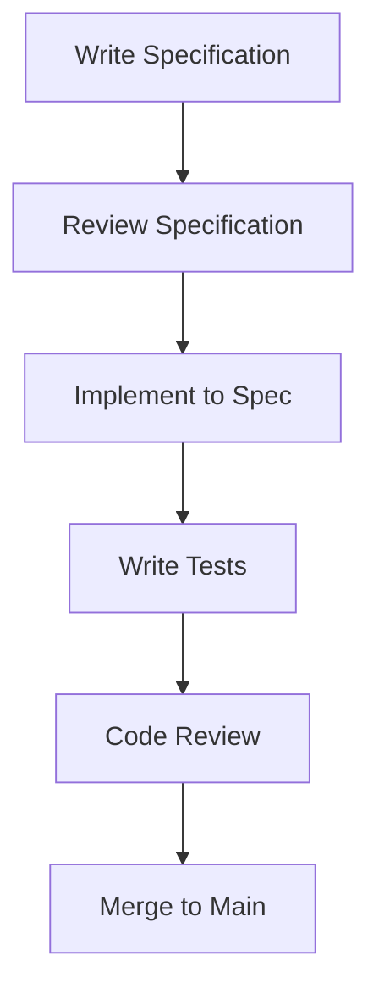

# Specification-Driven Development Workflow

## 1. Overview
This document defines the workflow for specification-driven development (SDD) in the GameVM project.

## 2. Development Process

### 2.1 Feature Development

### 2.2 Bug Fixes
1. Write failing test
2. Fix the code
3. Verify test passes
4. Update documentation if needed

## 3. Specification Requirements

### 3.1 Required Sections
1. **Purpose**: Why this spec is needed
2. **Interface**: Public API definitions
3. **Behavior**: Expected behavior
4. **Error Handling**: Error cases and recovery
5. **Performance**: Performance characteristics
6. **Security**: Security considerations

### 3.2 Review Process
- Two approvals required
- At least one review from domain expert
- All comments must be addressed

## 4. Testing Requirements

### 4.1 Test Coverage
- 100% of public API
- 90%+ branch coverage
- Edge cases and error conditions

### 4.2 Test Types
- Unit tests
- Integration tests
- Property-based tests
- Performance tests

## 5. Code Review Checklist

### 5.1 Specification Compliance
- [ ] Implementation matches spec
- [ ] All requirements are met
- [ ] No unspecified behavior

### 5.2 Code Quality
- [ ] Clean code principles followed
- [ ] No code smells
- [ ] Proper error handling

## 6. Documentation

### 6.1 Required Updates
- [ ] API documentation
- [ ] User guides
- [ ] Examples
- [ ] Migration guides (for breaking changes)

## 7. Versioning

### 7.1 Version Bumps
- **MAJOR**: Breaking changes
- **MINOR**: New features
- **PATCH**: Bug fixes

## 8. Continuous Integration

### 8.1 Required Checks
- [ ] Build passes
- [ ] All tests pass
- [ ] Code coverage meets requirements
- [ ] Documentation builds

## 9. Release Process

### 9.1 Release Checklist
- [ ] Update version numbers
- [ ] Update changelog
- [ ] Run full test suite
- [ ] Update documentation
- [ ] Tag release
- [ ] Publish artifacts

## 10. Best Practices

### 10.1 Writing Good Specifications
- Be precise and unambiguous
- Include examples
- Consider edge cases
- Document assumptions

### 10.2 Implementation Tips
- Write tests first
- Keep commits small
- Document design decisions
- Follow coding standards
