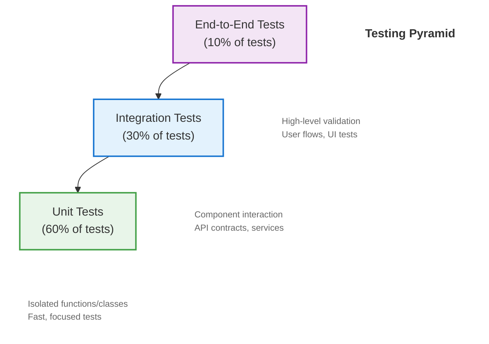

# GameVM Testing Strategy

## 1. Introduction

### 1.1 Purpose
This document outlines the testing strategy for GameVM, ensuring software quality through comprehensive test coverage across all components and language boundaries.

### 1.2 Key Principles
- **Automation**: Maximize automated test coverage
- **Isolation**: Test components in isolation when possible
- **Reproducibility**: Tests should be deterministic
- **Performance**: Include performance benchmarks
- **Cross-Platform**: Verify behavior across all supported platforms

### 1.3 Related Documents
- [Architecture Overview](./ArchitectureOverview.md)
- [Error Handling](./ErrorHandling.md)
- [Build System](./BuildSystem.md)

## 2. Testing Pyramid



### 2.1 Unit Tests (60%)
- Test individual functions/classes in isolation
- Fast execution (<1ms per test)
- No I/O or external dependencies
- High code coverage (>80%)

### 2.2 Integration Tests (30%)
- Test interactions between components
- May include database/network access
- Moderate execution time
- Focus on critical paths

### 2.3 End-to-End Tests (10%)
- Test complete user workflows
- Full system initialization
- Slowest to execute
- Validate system behavior

## 3. Test Types

### 3.1 Static Analysis
- **Purpose**: Catch issues without executing code
- **Tools**:
  - C++: Clang-Tidy, Cppcheck
  - C#: Roslyn Analyzers
  - JavaScript/TypeScript: ESLint, TypeScript compiler
- **Enforced via**: Pre-commit hooks and CI

### 3.2 Unit Tests
- **Purpose**: Verify individual units of code
- **Frameworks**:
  - C++: Google Test, Catch2
  - C#: xUnit/NUnit
  - JavaScript/TypeScript: Jest, Mocha
- **Best Practices**:
  - One assertion per test
  - Use test doubles (mocks, stubs, fakes)
  - Follow Arrange-Act-Assert pattern

### 3.3 Integration Tests
- **Purpose**: Verify component interactions
- **Approach**:
  - Test module boundaries
  - Verify data flow between components
  - Include database/network integration
- **Frameworks**:
  - Same as unit tests, with additional test containers
  - TestContainers for database testing

### 3.4 Performance Tests
- **Purpose**: Ensure performance requirements are met
- **Types**:
  - Load testing
  - Stress testing
  - Endurance testing
  - Scalability testing
- **Tools**:
  - BenchmarkDotNet (C#)
  - Google Benchmark (C++)
  - k6 (HTTP/API testing)

### 3.5 Security Tests
- **Purpose**: Identify vulnerabilities
- **Types**:
  - Static Application Security Testing (SAST)
  - Dynamic Application Security Testing (DAST)
  - Dependency scanning
- **Tools**:
  - OWASP ZAP
  - Snyk
  - GitHub Dependabot

## 4. Test Automation

### 4.1 CI/CD Pipeline
```yaml
# .github/workflows/ci.yml
name: CI
on: [push, pull_request]

jobs:
  test:
    runs-on: ${{ matrix.os }}
    strategy:
      matrix:
        os: [ubuntu-latest, windows-latest, macos-latest]
        config: [Debug, Release]
    steps:
      - uses: actions/checkout@v3
      - name: Setup
        run: ./scripts/setup.sh
      - name: Build
        run: ./scripts/build.sh --config ${{ matrix.config }}
      - name: Unit Tests
        run: ./scripts/test.sh unit
      - name: Integration Tests
        run: ./scripts/test.sh integration
      - name: E2E Tests
        if: matrix.config == 'Debug' && runner.os == 'Linux'
        run: ./scripts/test.sh e2e
```

### 4.2 Test Reporting
- **Code Coverage**: LCOV, Coverlet, istanbul
- **Test Results**: JUnit XML format
- **Dashboards**: Grafana, Azure DevOps
- **Notifications**: Slack, Email, GitHub Status Checks

## 5. Cross-Language Testing

### 5.1 Testing Shared Libraries
```csharp
// C# test calling into native library
[Test]
public unsafe void NativeLibrary_AddNumbers_ReturnsCorrectSum()
{
    // Arrange
    int a = 5, b = 3;
    
    // Act
    int result = NativeMethods.add_numbers(a, b);
    
    // Assert
    Assert.That(result, Is.EqualTo(8));
}
```

### 5.2 Contract Testing
- **Purpose**: Verify cross-language interfaces
- **Approach**:
  - Define API contracts using OpenAPI/Swagger
  - Generate client/server stubs
  - Verify both sides adhere to the contract

## 6. Test Data Management

### 6.1 Test Fixtures
- Use factory pattern for test data
- Generate deterministic random data
- Clean up after tests
- Consider using snapshot testing for complex outputs

### 6.2 Test Doubles
- **Mocks**: Verify interactions
- **Stubs**: Provide canned responses
- **Fakes**: Lightweight implementations
- **Dummies**: Placeholder values

## 7. Performance Testing

### 7.1 Benchmarking
```cpp
// C++ benchmark example
static void BM_StringCreation(benchmark::State& state) {
    for (auto _ : state) {
        std::string empty_string;
        benchmark::DoNotOptimize(empty_string);
    }
}
BENCHMARK(BM_StringCreation);
```

### 7.2 Load Testing
- **Tools**: k6, Locust, JMeter
- **Scenarios**:
  - Normal load
  - Peak load
  - Stress testing
  - Soak testing

## 8. Testing Best Practices

### 8.1 Naming Conventions
- `Test_[Method]_[Scenario]_[ExpectedResult]`
- Example: `Test_Add_WhenCalled_ReturnsSum`

### 8.2 Test Organization
```
tests/
  unit/
    math/
      vector2_tests.cpp
      matrix4x4_tests.cpp
  integration/
    physics/
      collision_detection_tests.cpp
  e2e/
    game_loop_tests.cpp
  perf/
    rendering_benchmarks.cpp
  test_utils/
    test_helpers.h
```

### 8.3 Flaky Tests
- Root cause and fix flaky tests immediately
- Use retries with exponential backoff for known flaky tests
- Tag flaky tests and track them

## 9. Testing in CI/CD

### 9.1 Pipeline Stages
1. **PR Validation**:
   - Unit tests
   - Static analysis
   - Code formatting

2. **Main Branch**:
   - Integration tests
   - Code coverage
   - Security scanning

3. **Release Candidate**:
   - Performance benchmarks
   - E2E tests
   - Load testing

### 9.2 Test Parallelization
- Run tests in parallel by default
- Use test sharding for large test suites
- Balance test execution across workers

## 10. Code Coverage

### 10.1 Coverage Goals
- Overall: >80%
- Critical components: >90%
- Generated code: >50%

### 10.2 Coverage Tools
- C++: gcov, llvm-cov
- C#: Coverlet, dotCover
- JavaScript: Istanbul, nyc

## 11. Test Maintenance

### 11.1 Test Reviews
- Include test code in code reviews
- Verify test quality and coverage
- Check for test smells

### 11.2 Test Refactoring
- Keep tests DRY (Don't Repeat Yourself)
- Use test data builders
- Extract common test utilities

## 12. References
1. [Google Testing Blog](https://testing.googleblog.com/)
2. [xUnit Test Patterns](http://xunitpatterns.com/)
3. [Test-Driven Development by Example](https://www.oreilly.com/library/view/test-driven-development/0321146530/)

## Changelog

### [1.0.0] - 2025-09-16
- Initial version
