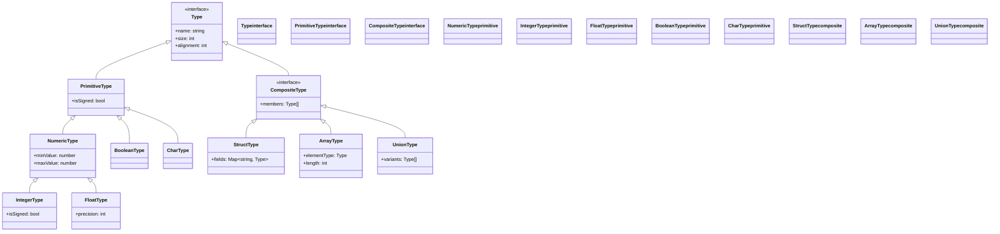
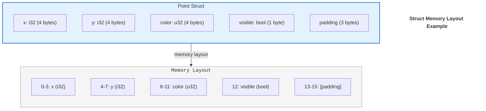

# GameVM Type System

## 1. Introduction

### 1.1 Purpose
This document defines the core type system used throughout GameVM, providing a unified type model that bridges different programming languages while maintaining performance and safety.

### 1.2 Scope
- Core type definitions
- Type conversion rules
- Memory layout specifications
- Cross-language type mapping

## 2. Core Types

### 2.1 Type Hierarchy



### 2.2 Primitive Types

| HLIR Type | Size  | Signed | Description           |
|-----------|-------|--------|-----------------------|
| `i8`      | 1 byte| Yes    | 8-bit integer         |
| `u8`      | 1 byte| No     | 8-bit unsigned integer|
| `i16`     | 2 bytes| Yes   | 16-bit integer        |
| `u16`     | 2 bytes| No    | 16-bit unsigned integer|
| `i32`     | 4 bytes| Yes   | 32-bit integer        |
| `u32`     | 4 bytes| No    | 32-bit unsigned integer|
| `i64`     | 8 bytes| Yes   | 64-bit integer        |
| `u64`     | 8 bytes| No    | 64-bit unsigned integer|
| `f32`     | 4 bytes| N/A   | 32-bit floating point |
| `f64`     | 8 bytes| N/A   | 64-bit floating point |
| `bool`    | 1 byte| N/A    | Boolean value         |
| `char`    | 4 bytes| N/A   | UTF-32 code point     |
| `void`    | 0     | N/A    | No type/return value  |

### 2.2 Composite Types

#### 2.2.1 Arrays
- Fixed-size, contiguous memory
- Zero-based indexing
- Stored in row-major order

```c
// Example: Array of 10 integers
int32_t[10] numbers;
```

#### 2.2.2 Structs
- Packed by default (no padding)
- Explicit padding can be added
- Maximum alignment of 8 bytes



```pascal
type
  TPoint = packed record
    X, Y: Int32;
  end;
```

#### 2.2.3 Unions
- Overlapping storage
- Size of largest member
- Explicitly marked as union

```c
union Value {
    int32_t as_int;
    float as_float;
    char* as_string;
};
```

## 3. Type Conversion

### 3.1 Implicit Conversions
- Widening numeric conversions
- `null` to reference types
- Derived to base class

### 3.2 Explicit Conversions
- Narrowing numeric conversions
- Between unrelated types
- Potentially unsafe operations

### 3.3 Cross-Language Type Mapping

#### 3.3.1 C/C++
```c
// C/C++ to HLIR
int32_t        → i32
unsigned int   → u32
float          → f32
double         → f64
bool           → bool
char*          → string
```

#### 3.3.2 C#
```csharp
// C# to HLIR
int            → i32
uint           → u32
float          → f32
double         → f64
bool           → bool
string         → string
```

#### 3.3.3 Java
```java
// Java to HLIR
int            → i32
long           → i64
float          → f32
double         → f64
boolean        → bool
String         → string
```

## 4. Memory Layout

### 4.1 Alignment Rules
- Primitive types aligned to their size
- Structs aligned to strictest member
- Arrays maintain element alignment

### 4.2 Packing
- `#pragma pack(1)` equivalent
- Manual padding when needed
- Platform-specific considerations

## 5. Type Safety

### 5.1 Runtime Checks
- Array bounds checking
- Null reference checking
- Type casting verification

### 5.2 Debug Features
- Type information in debug builds
- Runtime type identification
- Reflection capabilities

## 6. Optimization Considerations

### 6.1 Value Types
- Passed by value
- Stored inline
- No heap allocation

### 6.2 Reference Types
- Passed by reference
- Garbage collected
- Nullable by default

## 7. Related Documents
- [Architecture Overview](./ArchitectureOverview.md)
- [Language Integration](./LanguageIntegration.md)
- [Module System](./ModuleResolution.md)

## Changelog

### [1.0.0] - 2025-09-16
- Initial version
