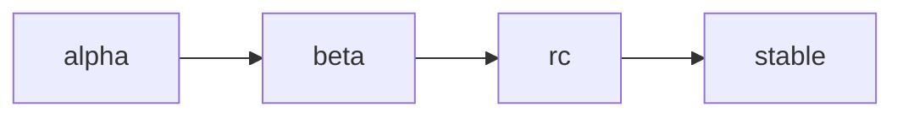

# Versioning Strategy

## 1. Semantic Versioning

GameVM follows [Semantic Versioning 2.0.0](https://semver.org/):

- **MAJOR** version for incompatible API changes
- **MINOR** version for backward-compatible functionality
- **PATCH** version for backward-compatible bug fixes

## 2. Version Number Format

```
v<MAJOR>.<MINOR>.<PATCH>[-<PRERELEASE>][+<BUILD>]
```

### 2.1 Examples
- Stable release: `v1.2.3`
- Pre-release: `v2.0.0-alpha.1`
- Build metadata: `v1.2.3+20230924`

## 3. Backward Compatibility

### 3.1 Patch Versions (x.y.Z)
- Must be fully backward compatible
- No new features or breaking changes
- Only bug fixes and security patches

### 3.2 Minor Versions (x.Y.z)
- May add new features
- Must maintain backward compatibility
- Deprecation warnings may be added

### 3.3 Major Versions (X.y.z)
- May include breaking changes
- Must document migration path
- Provide upgrade guide

## 4. Deprecation Policy

### 4.1 Deprecation Notice
- Features must be deprecated for at least one minor version
- Deprecation warnings must be clear and actionable
- Documentation must indicate deprecated status

### 4.2 Removal Process
1. Mark as deprecated in release notes
2. Add compile-time warnings
3. Document migration path
4. Remove in next major version

## 5. Pre-release Versions

### 5.1 Types of Pre-releases
- `alpha`: Early preview, unstable
- `beta`: Feature complete, may have bugs
- `rc`: Release candidate, stable enough for testing

### 5.2 Pre-release Stability


## 6. Version Support

### 6.1 Support Timeline
| Version | Release Date | End of Support |
|---------|--------------|-----------------|
| 1.0.0   | 2025-12-01   | 2026-12-01      |
| 2.0.0   | 2026-06-01   | 2027-06-01      |

### 6.2 Security Updates
- Critical security fixes backported to last 2 major versions
- Non-critical security fixes backported to latest minor version

## 7. Version Selection

### 7.1 Dependency Specification
```toml
[dependencies]
gamevm = "^1.2.3"  # Compatible with 1.2.3 to 2.0.0 (excluding)
gamevm = "~1.2.3"  # Compatible with 1.2.3 to 1.3.0 (excluding)
gamevm = ">=1.2.3 <2.0.0"  # Explicit range
```

## 8. Release Process

### 8.1 Release Branches
- `main`: Development of next major/minor version
- `release/vX.Y`: Maintenance of version X.Y

### 8.2 Release Checklist
- [ ] Update version numbers
- [ ] Update changelog
- [ ] Run full test suite
- [ ] Update documentation
- [ ] Tag release
- [ ] Publish artifacts

## 9. Version History

### 9.1 Version 1.0.0
- Initial stable release
- Core compiler and runtime
- Basic standard library

## 10. Upgrading Between Versions

### 10.1 Migration Guides
- [Upgrading to 2.0.0](./migrations/v2.0.0.md)
- [Upgrading to 1.0.0](./migrations/v1.0.0.md)
